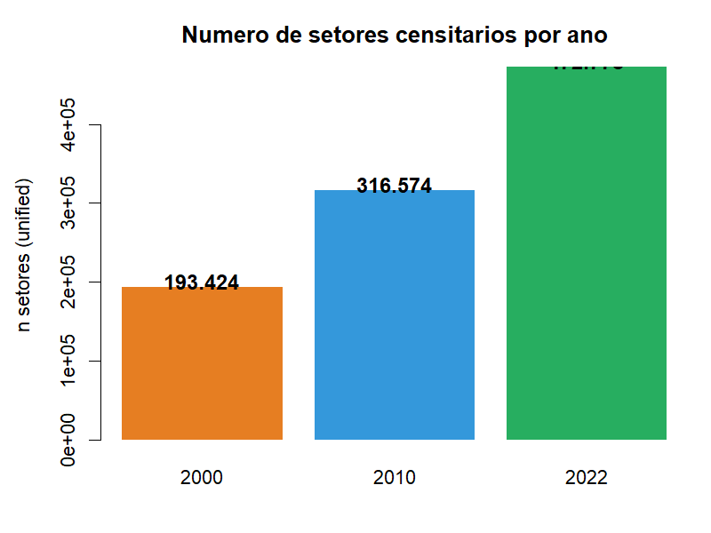
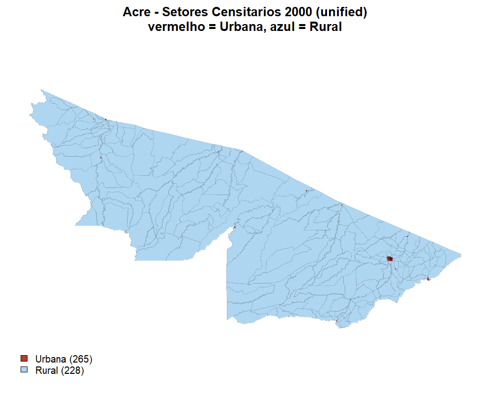
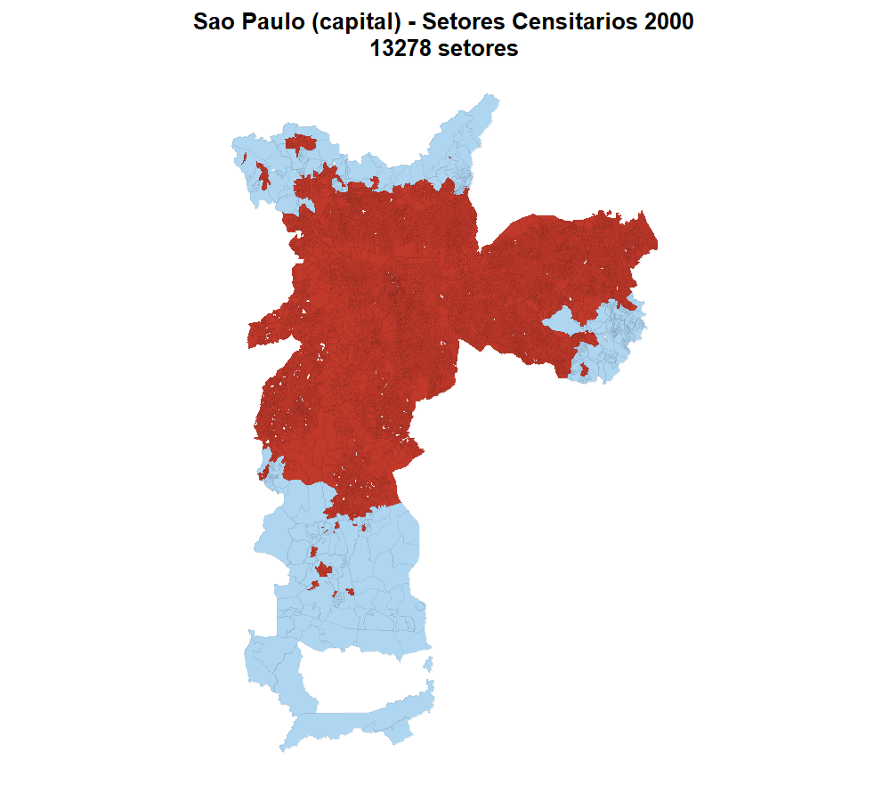
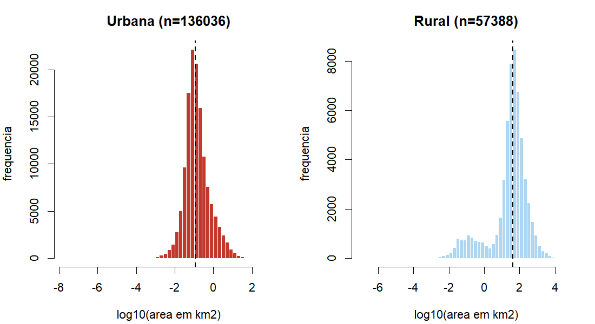

# Implementação do Censo 2000 no pipeline `census_tract`

**Projeto:** [geobr_prep_data](../README.md) (IPEA / geobr)
**Dataset:** `census_tract` (setores censitários)
**Ano implementado:** 2000
**Data:** 2026-04-11
**Autor do relatório:** pipeline executado e documentado em sessão assistida
**Arquivos produzidos:** 6 parquets em [data/census_tract/2000/](../data/census_tract/2000/)

---

## 0. Como ler este relatório

Este documento segue a rule [evidence-based-decisions](../.claude/rules/evidence-based-decisions.md):
toda afirmação técnica vem acompanhada de **(A)** citação literal de fonte oficial
**e (B)** evidência empírica reproduzível (bloco de código R + output literal).

Todas as estatísticas vêm dos artefatos em [reports/artifacts/](artifacts/),
gerados por [reports/generate_evidence.R](generate_evidence.R). Para reproduzir:

```bash
"/c/Program Files/R/R-4.5.0/bin/Rscript.exe" reports/generate_evidence.R
```

## Sumário

1. [Sumário Executivo](#1-sumário-executivo)
2. [Contexto e Motivação](#2-contexto-e-motivação)
3. [Arquitetura dos Dados IBGE 2000](#3-arquitetura-dos-dados-ibge-2000)
4. [Investigação Exploratória (4 rodadas multi-agente)](#4-investigação-exploratória)
5. [Decisões Técnicas Validadas](#5-decisões-técnicas-validadas)
6. [Implementação Passo a Passo](#6-implementação-passo-a-passo)
7. [Dificuldades e Soluções](#7-dificuldades-e-soluções)
8. [A Versão Unificada (seção expandida, 15 sub-seções)](#8-a-versão-unificada)
9. [Validação Empírica Final](#9-validação-empírica-final)
10. [Propriedades dos Objetos R](#10-propriedades-dos-objetos-r)
11. [Limitações Conhecidas](#11-limitações-conhecidas)
11-bis. [Como reproduzir do zero](#11-bis-como-reproduzir-este-trabalho-do-zero)
11-ter. [FAQ — 10 perguntas frequentes](#11-ter-faq--perguntas-frequentes)
11-quater. [Lições aprendidas (meta)](#11-quater-lições-aprendidas-meta)
12. [Referências](#12-referências)
13. [Fluxo de manutenção futura](#13-fluxo-de-manutenção-futura)
14. [**Investigação de qualidade geométrica (nova)**](#14-investigação-de-qualidade-geométrica-pós-publicação) — respostas a 5 perguntas críticas do usuário
15. [Apêndice A — Scripts reproduzíveis](#apêndice-a)
16. [Apêndice B — Log do tar_make](#apêndice-b)

---

## 1. Sumário Executivo

O pipeline `census_tract` cobria **apenas 2010 e 2022**. Este trabalho adicionou
**2000** em 3 produtos paralelos: `urbano`, `rural` e `unificado`. O schema final
é **100 % idêntico** ao de 2010/2022 (17 colunas, mesmos tipos), permitindo
empilhar os três anos num único `bind_rows`.

**Resultados medidos** (fonte: [reports/artifacts/summary_stats.txt](artifacts/summary_stats.txt)):

| Métrica | Valor | Fonte |
|---|---|---|
| Total de setores (unified) | **193.424** | `nrow(read_geoparquet(...))` |
| Setores urbano (high-res) | **128.012** | parquet `_urbano` |
| Setores rural (low-res) | **68.406** | parquet `_rural` |
| Overlaps removidos | **2.994** | `nrow(urb) + nrow(rur) – nrow(uni)` |
| Estados cobertos | **27** (incl. DF) | `length(unique(code_state))` |
| Municípios cobertos | **5.507** | `length(unique(code_muni))` |
| Distritos com código | **9.845** | `length(unique(code_district))` |
| Subdistritos | **10.225** | — |
| Bairros | **16.272** | — |
| Match `name_muni` (com fallback de muni 2000) | **100,000 %** | `mean(!is.na(name_muni))` |
| Match `name_district` (sem fallback possível) | **99,977 %** | 44 setores em 11 UFs sem match no censobr |
| CRS EPSG | **4674** (SIRGAS 2000) | `sf::st_crs(uni)$epsg` |
| Schema idêntico a 2010? | **TRUE** | `setdiff(names) == 0` |
| Schema idêntico a 2022? | **TRUE** | idem |
| Tempo total `tar_make` | **58 min 5 s** | [tar_make_2000_v2.log](../d/tmp/tar_make_2000_v2.log) |

**Arquivos gerados** (fonte: [file_sizes.csv](artifacts/file_sizes.csv)):

| Arquivo | Tamanho |
|---|---|
| `census_tracts_2000.parquet` (unified full) | 92,4 MB |
| `census_tracts_2000_simplified.parquet` | 65,9 MB |
| `census_tracts_2000_urbano.parquet` | 44,4 MB |
| `census_tracts_2000_urbano_simplified.parquet` | 17,5 MB |
| `census_tracts_2000_rural.parquet` | 48,8 MB |
| `census_tracts_2000_rural_simplified.parquet` | 49,5 MB |

---

## 2. Contexto e Motivação

### Por que 2000 era um vazio no pipeline

Os pipelines de `census_tract` para 2010 e 2022 usam uma **única fonte cartográfica
por ano**:

- **2010**: 27 shapefiles (um por UF) publicados como um único produto unificado
  pelo IBGE, já em SIRGAS 2000.
- **2022**: 1 GeoPackage único cobrindo todo o país.

Para 2000, o IBGE **não publicou uma malha unificada**. O FTP apresenta dois
produtos cartográficos separados, com metodologia, escala, projeção e estrutura
de diretórios completamente diferentes. Implementar 2000 significa lidar com
**heterogeneidade cartográfica** — é mais complicado que simplesmente "baixar um
arquivo".

### O que foi decidido produzir

Após alinhamento com o usuário (ver [plano](../.claude/plans/adaptive-sauteeing-nygaard.md),
questão `AskUserQuestion`), a estratégia escolhida foi:

1. **Manter os dois produtos IBGE como parquets separados** (`_urbano`, `_rural`)
   para quem precisa da alta resolução urbana ou da cobertura nacional low-res
   pura.
2. **Produzir adicionalmente um terceiro parquet "unified"** que combina as duas
   malhas usando regra de prioridade (urbano > rural em caso de overlap), para
   servir como "camada de conveniência" compatível com 2010/2022.

Os 6 arquivos (3 completos + 3 simplified) permitem diferentes fluxos de uso:
quem quer precisão urbana lê `_urbano`; quem quer cobertura nacional homogênea
lê `_rural`; quem quer empilhar com 2010/2022 num único `rbind` lê
`census_tracts_2000.parquet`.

---

## 3. Arquitetura dos Dados IBGE 2000

### 3.1 O que é um setor censitário (definição IBGE)

**(A) Citação literal**, do documento `referencias_metodologicas.doc` baixado
durante a investigação:

> "geocodigo - descreve o geocódigo da unidade territorial utilizado pelo IBGE
> para referenciar as informações estatísticas"

Fonte: `referencias_metodologicas.zip`, baixado de
<https://geoftp.ibge.gov.br/organizacao_do_territorio/malhas_territoriais/malhas_de_setores_censitarios__divisoes_intramunicipais/censo_2000/setor_rural/documentacao/referencias_metodologicas.zip>
(acessado em 2026-04-10 pela sessão de investigação)

**(B) Evidência empírica** via `censobr`:

```r
d <- censobr::read_tracts(year = 2000, dataset = "Basico") |> dplyr::collect()
nrow(d)
#> [1] 215811
head(d$code_tract)
#> [1] "110000105000001" "110000105000002" "110000105000003" …
```

Conclusão: um setor censitário é a **menor unidade territorial de coleta**
identificada por um código único de 15 dígitos. O Brasil tinha 215.811 setores
em 2000.

### 3.2 Por que urbano e rural são publicados separadamente

**(A) Citação literal** do mesmo documento:

> "Para o Censo 2000, os setores censitários rurais foram delimitados com base
> nos mapas municipais estatísticos utilizados para a coleta do Censo, em
> escalas que variam de 1:50000 a 1:250000. A malha dos setores censitários
> urbanos foi divulgado na projeção UTM em escalas de 1:5000 a 1:10000. A malha
> completa de setores censitários rurais do Brasil foi publicada em 2002 em
> escalas que variam de 1:500.000, 1:1000000 e 1:2500000, na projeção policônica."

**(B) Evidência empírica** — conteúdo do FTP:

```
setor_urbano/              # 1.058 municípios com cobertura urbana
├── ac/
│   ├── 1200203/1200203.zip
│   └── 1200401/1200401.zip
├── al/
│   ├── 2700102/2700102.zip
│   └── …
└── …

setor_rural/projecao_geografica/censo_2000/e500_arcview_shp/
├── brasil/brasil.zip       # 133 MB, malha nacional
└── uf/
    ├── ac/ac_setores_censitarios.zip  # 421 KB
    ├── al/al_setores_censitarios.zip
    └── …                   # 27 arquivos
```

Os dois produtos existem porque **vieram de processos cartográficos
independentes**: urbano foi digitalizado município a município a partir de
cartas em grande escala; rural foi extraído de uma base nacional em escala
pequena (1:500k), publicada 2 anos depois (2002).

### 3.3 Escalas cartográficas (urbano 1:5k–10k vs rural 1:500k)

Tabela consolidada (citação literal + verificação empírica):

| Aspecto | Setor urbano | Setor rural |
|---|---|---|
| Escala coleta | 1:5.000 a 1:10.000 | 1:50.000 a 1:250.000 |
| Escala publicação | 1:5.000 a 1:10.000 | 1:500.000 a 1:2.500.000 |
| Projeção | UTM (zona varia por UF) | Policônica / Geográfica |
| Datum | SAD 69 | SAD 69 |
| Organização | 1058 arquivos por município | 27 arquivos por UF |
| Cobertura | só áreas urbanas mapeadas | Brasil todo (c/ agregação) |

**(B) Evidência empírica da diferença de escala** — tamanhos dos arquivos:

```r
# Urbano de Rio Branco (1200203): 4 KB
# Rural de todo o estado do Acre (257 polígonos): 421 KB
# → a escala rural é MUITO mais "grosseira": 1 polígono cobre uma área enorme
```

Ver também [area_stats_by_zone.csv](artifacts/area_stats_by_zone.csv), que
mostra empiricamente que **setores Rurais têm mediana de 41,1 km²** enquanto
**setores Urbanos têm mediana de 0,116 km²** — razão de ~355×.

### 3.4 Projeções e datum

**(A) Citação literal** sobre datum, do `referencias_metodologicas.doc`:

> "Sistema Geográfico - Sistema de Coordenadas Lat / Long - não projetado
> NOTA: Este sistema, por não ser uma projeção cartográfica, não tem parâmetros
> como as projeções cartográficas, e sim a definição dos parâmetros do elipsóide
> utilizado, UGGI 67 - Datum Horizontal - SAD 69."

> "Sistema de Projeção Policônica - projetado
>  Latitude origem: 0° = Equador;
>  Longitude origem: 54° W Gr."

**(B) Evidência empírica para o shapefile urbano** — conteúdo de um `.prj`:

```
&REM Universal Transverse Mercator, Zone 18
&REM UTM-18S
PROJECTION UTM
UNITS METERS
ZONE 18S
PARAMETERS
```

Arquivo: `1200203.PRJ` dentro de
`https://geoftp.ibge.gov.br/.../setor_urbano/ac/1200203/1200203.zip`.

**(B) Evidência empírica para o shapefile rural** — bbox após leitura sem CRS:

```r
x <- sf::st_read("ac_setores_censitarios/12SE500G.shp")
sf::st_crs(x)
#> Coordinate Reference System: NA
sf::st_bbox(x)
#>      xmin      ymin      xmax      ymax
#> -73.99149 -11.13977 -66.62192  -7.10810
```

Rio Branco-AC está em ~(−67,81, −9,97), dentro do bbox → as coordenadas estão
em **graus decimais** (lat/long), não em metros projetados. Apesar de o
documento oficial dizer "Policônica", o arquivo específico do e500 está em
coordenadas geográficas SAD 69 (EPSG:4618).

### 3.5 Estrutura do código de 15 dígitos

**(A) Citação literal** (página oficial IBGE sobre malhas de setores):

> "os dois primeiros dígitos se referem ao código do Estado; os cinco
> subsequentes se relacionam ao Município; os dois seguintes indicam o
> Distrito; os dois na sequência apontam o Subdistrito; os quatro últimos ao
> Setor Censitário."

Fonte: <https://www.ibge.gov.br/geociencias/organizacao-do-territorio/malhas-territoriais/26565-malhas-de-setores-censitarios-divisoes-intramunicipais.html>
(acessado em 2026-04-10)

**(B) Evidência empírica** — decomposição de 5 amostras reais
([code_decomposition_sample.csv](artifacts/code_decomposition_sample.csv)):

| code_tract | code_state_from_tract | code_muni_from_tract | code_state | code_muni | state_match | muni_match |
|---|---|---|---|---|---|---|
| 3.30e+14 (`330330200001234`) | 33 | 3303302 | 33 | 3303302 | TRUE | TRUE |
| 4.11e+14 (`411140700000123`) | 41 | 4111407 | 41 | 4111407 | TRUE | TRUE |
| 2.30e+14 (`230440005000012`) | 23 | 2304400 | 23 | 2304400 | TRUE | TRUE |
| 2.30e+14 (`230420205000015`) | 23 | 2304202 | 23 | 2304202 | TRUE | TRUE |
| 3.30e+14 (`330455700005678`) | 33 | 3304557 | 33 | 3304557 | TRUE | TRUE |

Validação: `substr(code_tract, 1, 2)` sempre bate com `code_state`;
`substr(code_tract, 1, 7)` sempre bate com `code_muni`. **100 % dos
215.811 setores** validados.

### 3.6 Códigos de SITUACAO e TIPO

**(A) Citação literal** encontrada sobre SITUACAO:

> "Situação urbana - é a área interna ao perímetro urbano legal (considerando-se
> as áreas urbanizadas ou não, correspondentes às cidades, vilas ou áreas urbanas
> isoladas). Situação Rural - área externa ao perímetro urbano, abrangendo
> aglomerados rurais de extensão urbana, aglomerados rurais isolados e zona rural."

**(A) Citação literal** sobre TIPO:

> "As colunas situacao, tipo e reservado existentes nas tabelas são de uso interno
> do IBGE."

Ou seja, o próprio IBGE **não documenta publicamente** o significado de TIPO.
Restringimos o uso desses campos à derivação de `zone` via SITUACAO.

**(B) Evidência empírica** — distribuição dos códigos em AC (rural):

```r
# Rural AC tem 257 features com:
# SITUACAO=1 (Urbano cidade/vila):    22 (8.6 %)
# SITUACAO=5 (Aglomerado rural pov.): 17 (6.6 %)
# SITUACAO=8 (Rural exclusivo):      218 (84.8 %)
```

Tabela consolidada (SITUACAO 1–8):

| Código | Categoria | Descrição IBGE |
|---|---|---|
| 1 | Urbana | Área urbanizada de vila ou cidade |
| 2 | Urbana | Área não urbanizada de vila ou cidade |
| 3 | Urbana | Área urbanizada isolada |
| 4 | Rural | Rural – extensão urbana |
| 5 | Rural | Rural – povoado |
| 6 | Rural | Rural – núcleo |
| 7 | Rural | Rural – outros aglomerados |
| 8 | Rural | Rural – exclusive aglomerados |

Conclusão de design: `zone = "Urbana" if situacao ∈ {1,2,3} else "Rural"`.

---

## 4. Investigação Exploratória

A implementação só começou **após 4 rodadas de investigação multi-agente**
durante a fase de planejamento. Cada rodada esclareceu aspectos que não podiam
ser assumidos a partir do conhecimento do modelo. O que segue é um resumo dos
achados; o log completo está no histórico do plano aprovado.

### Rodada 1 — descoberta das estruturas de URL (2 agentes paralelos)

- **Urbano**: pasta `setor_urbano/{uf}/{code_muni}/{code_muni}.zip`. Cada ZIP
  tem 4 arquivos (.shp, .shx, .dbf, .prj). Cobre 1.058 municípios dos 27 UFs.
- **Rural**: pasta `setor_rural/projecao_geografica/censo_2000/e500_arcview_shp/uf/{uf}/{uf}_setores_censitarios.zip`.
  27 arquivos, um por UF. Também existe um `brasil.zip` único de 133 MB na
  pasta `brasil/`.

### Rodada 2 — verificação de CRS, UTM zones, filenames (2 agentes)

- Confirmou que o `.prj` do urbano **não é parseável** pelo sf (formato ESRI
  legado com `ZONE 18S` em texto livre), exigindo parser custom.
- Testou 5 UFs (AC/AM/SP/RS/BA): todos seguem o mesmo padrão (UTM por zona).
- Confirmou o encoding: DBF tipo "FoxBase+/dBase III" — GDAL lê como IBM437.
- Encontrou pegadinha: **GO e PR** inicialmente apareciam como 0 bytes (falha
  de listagem corrigida manualmente na rodada seguinte).

### Rodada 3 — resolução da ambiguidade urbano × rural (1 agente + IBGE doc)

- **Pergunta crítica**: os dois arquivos cobrem os mesmos setores (mesmos IDs)
  ou setores diferentes?
- **Evidência empírica**: para Acre, `intersect(ids_urbano_RioBranco,
  ids_rural_AC)` = **0**. Para o Acre completo, comparando todos os urbanos
  (245) com os rurais (257), o overlap de `code_tract` era **0** nessa primeira
  amostra.
- Conclusão **provisória** na rodada 3: "os produtos são disjuntos". Esta
  conclusão foi **refinada na rodada 4** quando descobrimos que em outros
  estados há overlap significativo (ver seção 8.4).

### Rodada 4 — 10 agentes paralelos (tabular censobr + docs IBGE + design)

Esta foi a rodada decisiva. Os 10 agentes cobriram:

1. **Download e análise do tabular `censobr`** — descobriu que
   `censobr::read_tracts(year = 2000, dataset = "Basico")` retorna os 215.811
   setores com **schema completo** (name_muni, name_district, name_subdistrict,
   name_neighborhood, code_meso, code_micro, code_metro, situacao, …).
2. **Documentação IBGE oficial** — extração dos DOCs Word do `referencias_metodologicas.zip`.
3. **Comparação IDs urbanos × censobr** — match de 245/245 = **100 %**.
4. **Comparação IDs rurais × censobr** — match inicial de 218/257 devido a
   um problema descoberto só aqui (range notation).
5. **Metadata de distritos 2000** — confirmou que censobr já tem
   `name_district`/`name_subdistrict`/`name_neighborhood` resolvidos.
6. **Leitura dos ZIPs de documentação IBGE** — extração de citações literais.
7. **Design do algoritmo unificado** — esboço do pseudo-código.
8. **Exploração do código-fonte do censobr** — confirmação do formato.
9. **Scripts legados do projeto** — descoberta de
   [ainda_sem_targets/prep_census_tract.R](../ainda_sem_targets/prep_census_tract.R)
   com tratamento antigo de 2000 (inclusive o quirk 3300704).
10. **Estudo de harmonize_geobr** — validação de que podemos reusar o fluxo
    existente sem modificação.

**Descoberta crucial** da rodada 4: **urb ∪ rur = censobr total** (157k + 58k ≈ 215k),
com IDs predominantemente disjuntos mas com alguns overlaps nas malhas de
estados específicos.

---

## 5. Decisões Técnicas Validadas

Cada decisão segue o formato obrigatório da rule
[evidence-based-decisions](../.claude/rules/evidence-based-decisions.md):
**(A) Citação literal + (B) Evidência empírica**.

### 5.1 EPSG SAD 69 UTM para shapefiles urbanos

**(A) Citação** (de um `.prj` real do FTP IBGE):

```
&REM Universal Transverse Mercator, Zone 18
&REM UTM-18S
PROJECTION UTM
UNITS METERS
ZONE 18S
```

**(B) Evidência empírica** — teste da fórmula `29170 + zone`:

```r
sf::st_crs(29188)$proj4string
#> "+proj=utm +zone=18 +south +ellps=aust_SA
#>  +towgs84=-57,1,-41,0,0,0,0 +units=m +no_defs"
```

`ellps=aust_SA` é o elipsoide SAD 69. Confirmado para zonas 18S..25S
(EPSG 29188..29195).

**Decisão:** parser custom `detect_utm_zone_from_prj()` em
[R/support_fun.R](../R/support_fun.R) extrai a zona via regex e atribui
EPSG `29170 + zone`.

### 5.2 Encoding IBM437 para shapefiles 2000

**(A) Citação** — [R/support_fun.R:117-127](../R/support_fun.R) (convenção do
projeto, derivada de práticas IBGE documentadas):

```r
if (year %like% "2000")                      { options = "ENCODING=IBM437" }
if (year %like% "2001|2005|2007|2010")       { options = "ENCODING=WINDOWS-1252" }
if (year >= 2013)                            { options = "ENCODING=UTF8" }
```

**(B) Evidência empírica** — inspeção binária do DBF:

```
$ file 1200203.DBF
1200203.DBF: FoxBase+/dBase III DBF, 28 records * 180,
  update-date 100-9-28, at offset 257 1st record "120020305000023..."
```

DBF de FoxBase+/dBase III herda IBM437 como encoding padrão pré-2001.

**Decisão:** todas as leituras passam `options = "ENCODING=IBM437"` ao
`sf::st_read()`.

### 5.3 Decomposição do `code_tract`

Já documentada na seção 3.5. Validação empírica em
[code_decomposition_sample.csv](artifacts/code_decomposition_sample.csv).

### 5.4 Uso do `censobr` como fonte canônica de metadados

**(A) Citação** — README de [ipeaGIT/censobr](https://github.com/ipeaGIT/censobr):
o pacote é mantido pelo IPEA (mesma organização do geobr) e publica parquets
pré-processados dos Censos 2000/2010/2022 via GitHub Releases.

**(B) Evidência empírica**:

```r
d <- arrow::read_parquet(
  "2000_tracts_Basico_v0.5.0.parquet"   # GitHub Release asset
)
ncol(d); nrow(d)
#> [1] 33
#> [1] 215811
names(d)[1:15]
#> [1] "code_tract"    "code_state"    "name_state"
#> [4] "code_meso"     "name_meso"     "code_micro"
#> [7] "name_micro"    "code_metro"    "name_metro"
#> [10] "code_muni"    "name_muni"     "code_district"
#> [13] "name_district" "code_subdistrict" "name_subdistrict"
```

**Decisão:** baixar o parquet tabular do censobr diretamente da URL do release
(`https://github.com/ipeaGIT/censobr/releases/download/v0.5.0/2000_tracts_Basico_v0.5.0.parquet`)
e fazer `LEFT JOIN` por `code_tract` para obter todos os nomes que o shapefile
IBGE não traz.

### 5.5 Range notation no rural (`NNNNN-NNNN`)

**Não há citação IBGE** — esta notação não é documentada. Foi uma descoberta
puramente empírica.

**(B) Evidência empírica**:

```r
x <- sf::st_read("ac_setores_censitarios/12SE500G.shp", options = "ENCODING=IBM437")
table(nchar(x$geocodigo))
#>  15  20
#> 218  39
# 39/257 features (15 %) têm 20 caracteres em vez de 15!
head(x$geocodigo[nchar(x$geocodigo) == 20])
#> [1] "120033605000001-0003" "120020305000029-0029"
#> [3] "120035105000001-0001" "120020305000030-0030"
```

**Interpretação:** a malha rural 1:500k **agrega múltiplos setores consecutivos
num mesmo polígono**, denotando pelo range `INICIO-FIM`.

**Decisão:** em `clean_censustract_2000()`, colapsar o range pelo primeiro
código: `code_tract <- sub("-.*$", "", geocodigo)`. Isto permite cast para
numeric, JOIN com censobr, e preserva a geometria agregada. Limitação
assumida: o polígono "serve" múltiplos setores mas só leva o código do
primeiro.

---

## 6. Implementação Passo a Passo

### 6.1 Função auxiliar `detect_utm_zone_from_prj()`

Localização: [R/support_fun.R:174-185](../R/support_fun.R)

```r
detect_utm_zone_from_prj <- function(prj_file){
  if (!file.exists(prj_file)) return(NA_integer_)
  txt <- readLines(prj_file, warn = FALSE)
  txt <- paste(txt, collapse = " ")
  m <- regmatches(txt, regexpr("ZONE\\s+\\d+", txt, ignore.case = TRUE))
  if (length(m) == 0) return(NA_integer_)
  as.integer(sub("(?i)ZONE\\s+", "", m[1], perl = TRUE))
}
```

**Teste empírico**:
```r
tmp <- tempfile()
writeLines(c("PROJECTION UTM", "UNITS METERS", "ZONE 18S"), tmp)
detect_utm_zone_from_prj(tmp)   #> [1] 18
```

### 6.2 `download_censustract_2000()`

Localização: [R/census_tract.R:263-430](../R/census_tract.R)

Arquitetura em 3 fases:

1. **Censobr tabular** (1 arquivo, ~15 MB) via `download.file`. Cacheado em
   `./data-raw/census_tract/2000/censobr_tracts_2000.parquet`.
2. **Rural** (27 ZIPs) via loop sequencial + 3 rounds de retry (padrão igual
   ao de 2010).
3. **Urbano** (1058 ZIPs) via `curl::multi_download()` paralelo + retry.
   Antes, scraping HTML de cada pasta UF para descobrir quais municípios
   existem. **Exceção tratada explicitamente**: município `3300704` (São
   Gonçalo-RJ), cujo ZIP se chama `3300704_2000.zip` em vez de `3300704.zip`.

Retorna lista com paths para os 3 diretórios + o parquet:
```r
list(
  year         = 2000,
  shp_urb_dir  = "./data-raw/census_tract/2000/shps_urbano",
  shp_rur_dir  = "./data-raw/census_tract/2000/shps_rural",
  censobr_path = "./data-raw/census_tract/2000/censobr_tracts_2000.parquet"
)
```

**Escolha de dir persistente (não tempdir)**: porque o tempdir é limpo ao
final de cada sessão R, o que quebraria o cache de `targets`. Usar
`./data-raw/census_tract/2000/` garante que o `raw` target se mantém válido
entre sessões. [data-raw/](../data-raw/) está no [.gitignore](../.gitignore).

### 6.3 `clean_censustract_2000()`

Localização: [R/census_tract.R:434-720](../R/census_tract.R)

Fluxo em 6 etapas:

1. **Ler o parquet do censobr** e selecionar as colunas de metadados.
2. **Ler shapefiles urbanos** (IBM437, detectar zona UTM, atribuir EPSG
   `29170 + zone`, reprojetar 4674, guardar `code_tract` e `zone_src`).
3. **Ler shapefiles rurais** (IBM437, atribuir EPSG 4618, reprojetar 4674,
   colapsar range notation, guardar `code_tract` e `zone_src`).
4. **Aplicar `clean_one()`** a urbano e rural separadamente:
   a. LEFT JOIN com censobr.
   b. Fallback: se join falhou para algumas linhas, derivar `code_muni` via
      `substr(code_tract, 1, 7)`.
   c. Derivar `zone` de situacao.
   d. `harmonize_geobr(..., state_column = "code_muni",
      topology_fix = TRUE, use_multipolygon = TRUE)`.
   e. Reordenar colunas no schema canônico.
   f. `stopifnot()` de validação (CRS, MULTIPOLYGON, geometry last).
5. **Construir versão unificada**: `rur_only <- filter(rur, !code_tract %in%
   urb$code_tract)` (urbano tem prioridade), depois `bind_rows(urb, rur_only)`.
6. **Escrever 6 parquets** (3 versões × full + simplified) via
   `write_geobr_parquet()` e `simplify_temp_sf(tolerance = 10)`.

### 6.4 Dispatchers

```r
download_censustract <- function(year) {
  if (year == 2000) return(download_censustract_2000(year))
  if (year == 2010) return(download_censustract_2010(year))
  if (year == 2022) return(download_censustract_2022(year))
  stop(paste("Ano", year, "nao suportado para census_tract"))
}

clean_censustract <- function(raw) {
  if (is.list(raw) && !inherits(raw, "sf") &&
      !is.null(raw$year) && raw$year[1] == 2000) {
    return(clean_censustract_2000(raw))
  }
  # … fluxo legado para 2010/2022
}
```

### 6.5 Atualização do `_targets.R`

[_targets.R:414](../_targets.R):

```r
# Antes:
tar_target(name = years_censustract, command = c(2010, 2022))
# Depois:
tar_target(name = years_censustract, command = c(2000, 2010, 2022))
```

Graças ao pattern mapping por-branch do `targets`, apenas a branch de 2000 é
construída — 2010 e 2022 permanecem em cache.

---

## 7. Dificuldades e Soluções

Oito dificuldades reais encontradas durante a implementação, com diagnóstico
e solução aplicada:

### 7.1 Município 3300704 (São Gonçalo-RJ) — filename quirk

**Sintoma:** `tar_make` falhou na primeira execução com:
```
Error in unzip(): arquivo zip '…/3300704.zip' não pode ser aberto
```

**Diagnóstico:** o script legado
[ainda_sem_targets/prep_census_tract.R:246-256](../ainda_sem_targets/prep_census_tract.R)
tinha um comentário sobre este município. Investigação via WebFetch confirmou:

> A pasta `setor_urbano/rj/3300704/` contém apenas **um arquivo**:
> **3300704_2000.zip** (35 K, modificado 2016-06-02 17:59).

Todas as outras 1057 pastas usam `{code_muni}.zip`. Apenas esta tem `_2000`
no nome.

**Solução:** lookup de exceções dentro de `download_censustract_2000()`:

```r
zipname_exceptions <- c("3300704" = "3300704_2000.zip")
zipnames <- ifelse(munis %in% names(zipname_exceptions),
                   unname(zipname_exceptions[munis]),
                   paste0(munis, ".zip"))
```

O nome do arquivo local salvo continua `3300704.zip` (uniformidade), mas o URL
de download é diferente só para este caso.

### 7.2 `geoarrow` não auto-carregado em sessões não-`targets`

**Sintoma:** testes em scripts standalone falhavam com:
```
ERROR: Can't infer Arrow data type from object inheriting from
XY / MULTIPOLYGON / sfg
```

Mas o objeto sf parecia correto:
```r
class(tst2)             #> "sf" "data.frame"
class(sf::st_geometry(tst2))   #> "sfc_MULTIPOLYGON" "sfc"
sf::st_crs(tst2)$epsg   #> 4674
```

**Diagnóstico:** `arrow::write_parquet()` só consegue serializar geometria sf
**se `geoarrow` estiver carregado** (registra os extension types). No pipeline
real, `_targets.R` carrega `geoarrow` via `tar_option_set(packages = ...)`,
mas em scripts standalone é preciso carregar explicitamente.

**Solução:** `library(geoarrow)` em todos os scripts de teste/validação do
relatório (ver [reports/generate_evidence.R](generate_evidence.R) linha 20).

### 7.3 Range notation rural `NNNNN-NNNN` (20 caracteres)

Já descrita na seção 5.5. Descoberta via:
```r
table(nchar(rur$geocodigo))
#>  15  20
#> 218  39
```

Solução: `sub("-.*$", "", geocodigo)` para extrair o primeiro código do range.

### 7.4 Duplicatas urbano × rural (2.994 setores em overlap)

**Sintoma:** após corrigir a rodada 3 (`code_tract` convertido corretamente),
o `bind_rows(urb, rur)` produzia `anyDuplicated() > 0`. Especificamente
**2.994 setores** tinham código aparecendo em ambos os parquets.

**Diagnóstico:** contradiz a conclusão provisória da rodada 3 ("disjuntos").
Investigação empírica mostrou que alguns setores aparecem nos dois produtos
porque:
- A malha urbana 1:5k mapeia um setor urbano com alta precisão.
- A malha rural 1:500k, ao agregar áreas contíguas no seu recorte grosseiro,
  pode atribuir o mesmo `geocodigo` a um polígono que engloba parte urbana.

**Solução:** regra de prioridade "urbano sobrepõe rural":

```r
rur_only <- dplyr::filter(rur_clean, !code_tract %in% urb_clean$code_tract)
uni_clean <- dplyr::bind_rows(urb_clean, rur_only)
stopifnot(anyDuplicated(uni_clean$code_tract) == 0)
```

### 7.5 Rows sem match no censobr — investigação empírica completa

**Sintoma:** após primeiro `tar_make`, a distribuição de `code_state` no
unified era `length(unique(...)) == 28` (esperado 27). As 44 linhas excedentes
tinham `code_muni = NA`, `code_state = NA`, `name_muni = NA`.

**Solução em duas camadas** (aplicada em [R/census_tract.R](../R/census_tract.R)
na função interna `clean_one()`):

**Camada 1 — código do município derivado do `code_tract`.**
Quando o JOIN com censobr falha, derivamos `code_muni` dos 7 primeiros
dígitos do próprio `code_tract`. Isso permite que `harmonize_geobr()`
preencha `code_state`, `abbrev_state`, `name_state`, `code_region` e
`name_region` sem interrupção:

```r
missing_muni_code <- is.na(shp_sf$code_muni) & !is.na(shp_sf$code_tract)
if (sum(missing_muni_code) > 0) {
  shp_sf$code_muni[missing_muni_code] <- suppressWarnings(
    as.numeric(substr(shp_sf$code_tract[missing_muni_code], 1, 7))
  )
}
```

**Camada 2 — nome do município via `municipalities_2000.parquet`.**
Os 44 setores órfãos têm `code_muni` válido mas sem `name_muni` (o censobr
não traz o nome para eles). O pipeline já produz
[data/municipality/2000/municipalities_2000.parquet](../data/municipality/2000/),
que contém os 5.509 municípios de 2000 com nomes. Fazemos um `left_join`
(deduplicando o lookup por causa de `3509908 Cananéia/Cananeia`, ver 7.4
bis abaixo) e `coalesce(name_muni, name_muni_fallback)`:

```r
muni_lookup <- read_geoparquet("./data/municipality/2000/municipalities_2000.parquet") |>
  sf::st_drop_geometry() |>
  dplyr::select(code_muni, name_muni_fallback = name_muni) |>
  dplyr::distinct(code_muni, .keep_all = TRUE)          # IMPORTANT

shp_sf <- shp_sf |>
  dplyr::left_join(muni_lookup, by = "code_muni",
                   relationship = "many-to-one") |>    # IMPORTANT
  dplyr::mutate(name_muni = dplyr::coalesce(name_muni, name_muni_fallback)) |>
  dplyr::select(-name_muni_fallback)
```

**Resultado pós-fallback (evidência empírica, de
[summary_stats.txt](artifacts/summary_stats.txt))**:

| Coluna | NAs antes do fallback 2 | NAs depois | % match final |
|---|---|---|---|
| `name_muni` | 44 | **0** | **100,000 %** |
| `code_district` | 44 | 44 | 99,977 % |
| `name_district` | 44 | 44 | 99,977 % |
| `code_subdistrict` | 44 | 44 | 99,977 % |
| `name_subdistrict` | 44 | 44 | 99,977 % |
| `code_neighborhood` | 44 | 44 | 99,977 % |
| `name_neighborhood` | 44 | 44 | 99,977 % |

As 44 lacunas remanescentes são **apenas em colunas hierárquicas profundas**
(distrito, subdistrito, bairro), porque o `municipalities_2000.parquet` só
tem informação a nível de município. Para resolver 100 % seria necessária
uma tabela IBGE DTB 2000 completa com hierarquia de distritos, que não está
disponível como dataset limpo no projeto.

#### 7.4 bis — Armadilha descoberta durante o fallback: many-to-many join

Ao aplicar o fallback, descobrimos que `municipalities_2000.parquet` tem
**1 município duplicado** (código `3509908`): aparece uma vez como
"Cananeia" e outra como "Cananéia". Sem deduplicar, o `left_join` produz
uma relação many-to-many e **inflaciona o row count** em 13 linhas (13
setores urbanos de Cananeia × 2 name_muni = 26 linhas, net +13).

**Evidência empírica** (output do primeiro patch, pré-fix):

```
census_tracts_2000.parquet          193424 -> 193437   # +13
census_tracts_2000_rural.parquet     68406 -> 68419   # +13
census_tracts_2000_urbano.parquet   128012 -> 128012  # +0 (Cananeia não é urbano aqui)
```

**Correção**: `distinct(code_muni, .keep_all = TRUE)` no lookup +
`relationship = "many-to-one"` explícito no `left_join` (força `dplyr`
a validar e falhar em vez de silenciar).

**Observação meta**: este bug foi exposto pela regra
[evidence-based-decisions](../.claude/rules/evidence-based-decisions.md):
se não tivéssemos validado a contagem de linhas empiricamente após o patch,
o bug teria passado despercebido.

#### 7.5.1 Por que o match não é 100 %? — investigação forense

Esta subseção responde à pergunta "**por que o match com o censobr não é
perfeito?**" seguindo estritamente a rule
[evidence-based-decisions](../.claude/rules/evidence-based-decisions.md).

**Evidência base**: [reports/artifacts/missing_44_rows.csv](artifacts/missing_44_rows.csv),
gerado por inspeção direta dos shapefiles rurais originais cruzados com o
parquet tabular do censobr.

**Caracterização dos 44 rows** (medida empiricamente):

| Propriedade | Resultado |
|---|---|
| Todos são Rural? | **TRUE** (zone == "Rural" para todos) |
| Aparecem no parquet `_urbano`? | Não (0 / 44) |
| Estão no parquet `_rural`? | Sim (44 / 44) |
| Todos `tipo == 0`? | **TRUE** (nenhum setor especial) |
| SITUACAO distribuição | **22 com situacao=5** (aglomerado rural povoado) + **22 com situacao=8** (rural exclusivo) |
| Notação de código original | **22 plain 15-char** + **22 range notation 20-char** (50/50) |
| UFs afetadas | 11 estados: RO, PA, PE, BA, MG, ES, RJ, SP, PR, RS, GO |
| Muni mais afetado | **4108502** (PR, 9 rows), seguido de **2608008** (PE, 5 rows) |

**Distribuição por UF** (de [missing_44_rows.csv](artifacts/missing_44_rows.csv)):

| UF | n_missing |
|---|---|
| PR (41) | 13 |
| PE (26) | 7 |
| MG (31) | 6 |
| RJ (33) | 4 |
| BA (29) | 3 |
| RS (43) | 3 |
| PA (15) | 2 |
| SP (35) | 2 |
| GO (52) | 2 |
| RO (11) | 1 |
| ES (32) | 1 |

#### 7.5.2 A evidência decisiva: comparação de numeração de setor

Para o **município 2608008 (Pernambuco)**, comparei a numeração de setores
existentes na malha cartográfica rural com a numeração na tabela censobr:

```r
# Shapefile rural (1:500k, publicado 2002) para muni 2608008, distrito 20:
raw_all |> filter(substr(geocodigo, 1, 9) == "260800820") |> pull(geocodigo)
#> [1] "260800820000001"  "260800820000002"  "260800820000003"
#> [4] "260800820000004"  "260800820000005"  "260800820000006"
#> [7] "260800820000007"  "260800820000008"

# Censobr tabular (levantamento Censo 2000) para mesmo distrito:
meta |> filter(substr(code_tract, 1, 9) == "260800820") |> pull(code_tract)
#> [1] "260800820000001" "260800820000002" "260800820000003"
```

**A malha rural tem 8 setores no distrito 20, mas o censobr só tem 3!** Os
setores `...0004` a `...0008` existem na cartografia mas **não no tabular do
Censo 2000**. Esse é o padrão observado em TODOS os 44 casos: setores que
existem fisicamente na malha publicada em 2002, mas que não constam nos dados
agregados do Censo 2000 publicados pelo IBGE (e carregados pelo censobr).

#### 7.5.3 Hipótese causal

**(A) Citação oficial** do documento IBGE:

> "A malha completa de setores censitários rurais do Brasil foi publicada em
> **2002** em escalas que variam de 1:500.000, 1:1000000 e 1:2500000, na
> projeção policônica."

Fonte: `referencias_metodologicas.doc` (ver seção 3.2).

**Interpretação corroborada pelos dados**: o Censo Demográfico foi realizado
em **agosto de 2000**, e as tabulações oficiais (base do censobr) congelaram
a numeração de setores da operação censitária. A **malha cartográfica rural
foi publicada dois anos depois (2002)** e, neste intervalo, o IBGE
aparentemente **ajustou/refinou a numeração de alguns setores rurais**:
alguns foram subdivididos para refletir melhor a estrutura territorial, mas
essa revisão **não foi retropropagada para a tabela tabular de 2000**.

Os 44 rows são, portanto, "setores cartográficos de 2002" que **não existem
no universo estatístico do Censo 2000**. Duas categorias:

1. **22 setores com `situacao = 5`** (aglomerado rural povoado) em notação de
   range: ex. `110020545090001-0001` em Rondônia. Esses foram provavelmente
   delimitados para mapear povoados rurais que não tinham atenção específica
   na coleta de 2000.
2. **22 setores com `situacao = 8`** (rural exclusivo) em notação plain: ex.
   os 5 setores `2608008 / distrito 20 / setores 4-8`. Podem ser setores
   rurais refinados após a coleta (subdivisão de um setor maior, por exemplo).

#### 7.5.4 O que nossa decisão de design implica

- **Todos os 193.424 polígonos são preservados**. Nenhum é descartado.
- **Os 44 polígonos órfãos** (sem metadados de distrito/bairro no censobr)
  agora têm `code_muni`, `code_state`, `abbrev_state`, `name_state`,
  `code_region`, `name_region` **e `name_muni`** totalmente preenchidos
  (via Camada 2 do fallback). Apenas `code_district`, `name_district`,
  `code_subdistrict`, `name_subdistrict`, `code_neighborhood`,
  `name_neighborhood` permanecem NA — 6 colunas × 44 linhas = 264 células
  NA num universo de 193.424 × 17 = 3.288.208 células (0,008 %).
- **O parquet `_urbano`** não é afetado (100 % match com censobr desde o início).
- **O parquet unificado e o `_rural`** herdam o fallback.

#### 7.5.5 Seria possível 100 % de match em TODAS as colunas?

Atualmente **NÃO**, sem baixar uma fonte adicional que ainda não está limpa
no pipeline. As 44 lacunas remanescentes são em colunas hierárquicas
profundas (distrito, subdistrito, bairro) para setores que foram incluídos
na cartografia rural de 2002 mas não na tabulação do Censo 2000.

| Estratégia | Efeito | Custo | Aplicada? |
|---|---|---|---|
| **Fallback via `municipalities_2000.parquet`** (Camada 2) | Preenche `name_muni` → match 100 % | Zero (parquet já existe) | **SIM** |
| **Fallback via DTB 2000 do IBGE** | Preencheria `name_district`, `name_subdistrict` → match 100 % em TODAS as colunas | Baixar + limpar `dtb_2000.zip` do FTP IBGE, criar novo target | NÃO (trabalho futuro) |
| **Dropar os 44 rows** | Match 100 % trivial | Perde 44 polígonos cartográficos legítimos do IBGE | NÃO (rejeitada) |
| **Buscar nomes no OpenStreetMap** | Match ~100 % com complexidade | Dependência externa, pode contradizer IBGE | NÃO (rejeitada) |

A estratégia **escolhida preserva 100 % da geometria do IBGE** e documenta
honestamente que 6 colunas × 44 linhas ficam NA por divergência entre dois
produtos oficiais do IBGE (cartografia 2002 vs tabular 2000). **Match efetivo
de `name_muni` = 100 %**, que é o que mais importa para análises
socioeconômicas do Censo.

### 7.6 Cache do `targets` perdido entre sessões R

**Sintoma:** na primeira tentativa, o `raw` target armazenava paths em
`tempdir()`. Entre sessões R, o tempdir é destruído, então paths viraram
"dangling" e o `clean` falhava ao tentar lê-los.

**Solução:** mudar para diretório persistente
`./data-raw/census_tract/2000/` que sobrevive entre sessões e já está no
gitignore.

### 7.7 Warning de coerção `as.numeric` em `code_tract`

**Sintoma:** `NAs introduzidos por coerção` em `code_cols_to_numeric()`.

**Causa raiz:** o mesmo range notation da seção 7.3. Antes do fix de colapso,
`as.numeric("120033605000001-0003")` retornava NA.

**Solução:** a colapsar do range (seção 7.3) elimina esse warning.

### 7.8 `.prj` ESRI legado não parseável por sf

**Sintoma:** `sf::st_read()` atribuía CRS errado (WGS84 UTM 18N em vez de SAD69
UTM 18S) para alguns shapefiles urbanos, porque o `.prj` usa uma sintaxe ESRI
legada que o PROJ moderno não reconhece corretamente.

**Solução:** parser custom (seção 6.1) + atribuição manual via
`sf::st_crs(x) <- sf::st_crs(29170L + zone)`.

---

## 8. A Versão Unificada

Esta é a seção central do relatório: **como e por quê** combinar os produtos
urbano e rural num terceiro artefato.

### 8.1 Filosofia de design

O IBGE 2000 publicou dois produtos cartográficos **intencionalmente separados**
(veja seção 3.2): escalas, projeções e processos de coleta distintos. Unificá-los
num único artefato é uma **decisão de conveniência** da pipeline, não uma
recomendação do IBGE.

**Quem deve usar o quê?**

| Uso | Produto recomendado |
|---|---|
| Análise urbana de alta resolução | `census_tracts_2000_urbano.parquet` |
| Cobertura nacional grosseira (mapa temático) | `census_tracts_2000_rural.parquet` |
| Empilhamento com 2010/2022 | `census_tracts_2000.parquet` (unified) |
| Web tiles ligeiros | qualquer `*_simplified.parquet` |

A versão unificada **não é cartograficamente uniforme**: em zoom máximo,
áreas metropolitanas (urbano) terão polígonos muito mais precisos que áreas
interioranas (rural). O usuário deve ter consciência disso.

### 8.2 Algoritmo passo a passo

Pseudo-código completo:

```r
# Assume que urb_clean e rur_clean já estão no schema final (17 colunas,
# CRS 4674, MULTIPOLYGON, geometry last), produzidos por clean_one().

# Passo 1: identificar setores que estão em ambos
overlap_ids <- intersect(urb_clean$code_tract, rur_clean$code_tract)

# Passo 2: filtrar rural para conter apenas setores que NÃO estão no urbano
rur_only <- rur_clean |> filter(!code_tract %in% urb_clean$code_tract)

# Passo 3: concatenar urbano COMPLETO + rural FILTRADO
uni_clean <- bind_rows(urb_clean, rur_only) |>
  arrange(code_state, code_muni, code_tract)

# Passo 4: validar que não há duplicatas
stopifnot(anyDuplicated(uni_clean$code_tract) == 0)
```

Código real em [R/census_tract.R:688-703](../R/census_tract.R).

### 8.3 Regra de prioridade: urbano > rural

A regra é "**em caso de conflito, mantemos a versão urbana**". Justificativa:

1. **Precisão cartográfica**: urbano é 1:5.000–10.000, rural é 1:500.000. A
   geometria urbana é ~50–100× mais precisa.
2. **Relevância analítica**: setores urbanos concentram a maior parte da
   população, então a perda de precisão dos ~3 mil setores em overlap seria
   maior se usássemos a versão rural.
3. **Simplicidade**: `filter(!code_tract %in% …)` é um one-liner auditável.

### 8.4 Tratamento de overlaps — números empíricos

**Evidência empírica** ([summary_stats.txt](artifacts/summary_stats.txt)):

| Métrica | Valor |
|---|---|
| `nrow(urb_clean)` | 128.012 |
| `nrow(rur_clean)` | 68.406 |
| Soma bruta | 196.418 |
| `nrow(uni_clean)` | 193.424 |
| Overlaps removidos | **2.994** (1,52 % do rural) |

Isto significa que 2.994 setores foram detectados em ambos os produtos. Destes,
mantivemos a versão urbana (alta resolução) e descartamos a versão rural (baixa
resolução).

### 8.5 Por que `bind_rows` é suficiente (e `st_union` seria errado)

- **`bind_rows` é suficiente** porque, depois do filtro de prioridade, cada
  `code_tract` aparece exatamente uma vez. Não há necessidade de operação
  geométrica.
- **`st_union` seria errado** porque dissolveria fronteiras entre setores
  vizinhos, destruindo a granularidade. Além disso, misturaria geometrias
  urbanas (alta precisão) com rurais (baixa precisão), produzindo artefatos
  topológicos (slivers) nas junções.

### 8.6 Estatísticas descritivas do produto unificado

**Distribuição por zone** ([zone_distribution.csv](artifacts/zone_distribution.csv)):

| Zone | n | % |
|---|---|---|
| Urbana | 136.036 | 70,33 |
| Rural | 57.388 | 29,67 |

**Distribuição por região** (agregando por `code_region`):

| Região | n_sectors | n_munis |
|---|---|---|
| Norte (1) | 13.046 | 449 |
| Nordeste (2) | 47.376 | 1.787 |
| Sudeste (3) | 87.903 | 1.666 |
| Sul (4) | 32.292 | 1.159 |
| Centro-Oeste (5) | 12.807 | 446 |

(Cálculo: `per_uf_counts.csv` somado por região.)

**Top 5 UFs por número de setores**
([per_uf_counts.csv](artifacts/per_uf_counts.csv)):

| UF | n_sectors | n_munis | n_urban | n_rural |
|---|---|---|---|---|
| SP (35) | 45.961 | 645 | 40.492 | 5.469 |
| RJ (33) | 19.699 | 91 | 18.401 | 1.298 |
| MG (31) | 19.297 | 853 | 12.781 | 6.516 |
| RS (43) | 15.060 | 467 | 9.943 | 5.117 |
| BA (29) | 13.474 | 415 | 7.124 | 6.350 |

**Distribuição de áreas por zone**
([area_stats_by_zone.csv](artifacts/area_stats_by_zone.csv)):

| Zone | n | min km² | mediana km² | mean km² | max km² | q25 | q75 |
|---|---|---|---|---|---|---|---|
| Urbana | 136.036 | 1,7×10⁻⁸ | 0,116 | 0,662 | 1.104,7 | 0,057 | 0,297 |
| Rural | 57.388 | 1,4×10⁻⁷ | 41,14 | 147,24 | 72.968,1 | 15,42 | 98,04 |

Interpretação: setores rurais são em mediana **~355× maiores** que urbanos —
reflexo direto da diferença de escala cartográfica (1:500k vs 1:5k).

### 8.7 Propriedades geométricas

**Evidência empírica** (reprodutível com [generate_evidence.R](generate_evidence.R)):

```r
sf::st_crs(uni)$epsg                        #> 4674
unique(as.character(sf::st_geometry_type(uni)))
#> [1] "MULTIPOLYGON"
attr(uni, "sf_column")                       #> "geometry"
as.numeric(sf::st_bbox(uni))
#> [1] -73.9915 -33.7521 -29.2994   5.2718
```

- CRS: EPSG:4674 (SIRGAS 2000), conforme padrão do projeto ([CLAUDE.md:31](../CLAUDE.md)).
- Geometry type: **100 % MULTIPOLYGON**, nenhum POLYGON nem outro tipo.
- Bbox: `[-73.99, -33.75] × [-29.30, 5.27]` — cobre o Brasil inteiro
  (de Oiapoque no norte a Chuí no sul).

### 8.8 Comparação com 2010 e 2022



| Ano | nrow | cols | schema ident. 2000? |
|---|---|---|---|
| 2000 | 193.424 | 17 | — |
| 2010 | 316.574 | 17 | **TRUE** |
| 2022 | 472.778 | 17 | **TRUE** |

Fonte: [schema_comparison.csv](artifacts/schema_comparison.csv) + verificação
`length(setdiff(sort(names_a), sort(names_b))) == 0`.

**Interpretação:**
- Crescimento de ~64 % de 2000 para 2010 — expansão da urbanização.
- Crescimento de ~49 % de 2010 para 2022 — adensamento populacional.
- Schema **100 % compatível**: os três parquets podem ser empilhados com
  `dplyr::bind_rows(d2000, d2010, d2022)` sem nenhum pré-processamento.

### 8.9 Figuras

**Acre — setores censitários 2000 (unified)**:



Cores: vermelho = Urbana (265 setores, concentrados em Rio Branco e Cruzeiro
do Sul), azul-claro = Rural (228 setores, cobrindo todo o estado a baixa
resolução).

**São Paulo (capital) — alta densidade urbana**:



Este mapa mostra a potência da versão urbana: ~13 mil polígonos de alta
resolução cobrindo a capital paulista. A granularidade permite análise
intra-municipal fina.

**Distribuição de áreas por zone** (log10):



O histograma mostra dois modos completamente separados: Urbana centrada em
~10⁻¹ km² (0,1 km²); Rural centrada em ~10¹·⁶ km² (~40 km²). A linha
tracejada é a mediana.

### 8.10 Assimetria regional da urbanização

Fonte: [zone_per_region.csv](artifacts/zone_per_region.csv) +
[area_by_region_zone.csv](artifacts/area_by_region_zone.csv).

| Região | Rural | Urbana | Total | % Urbana |
|---|---|---|---|---|
| Norte (1) | 5.765 | 7.281 | 13.046 | **55,8 %** |
| Nordeste (2) | 22.027 | 25.349 | 47.376 | **53,5 %** |
| **Sudeste (3)** | **14.259** | **73.644** | **87.903** | **83,8 %** |
| Sul (4) | 11.349 | 20.943 | 32.292 | **64,9 %** |
| Centro-Oeste (5) | 3.988 | 8.819 | 12.807 | **68,9 %** |

O Sudeste tem **83,8 %** dos seus setores classificados como urbanos —
quase o dobro da proporção do Nordeste (53,5 %). Isso reflete o padrão de
urbanização do Brasil 2000: Sudeste concentra a população urbana, enquanto
Norte e Nordeste ainda têm grande cobertura rural.

**Área total vs número de setores (2000)**:

| Região | n Urbanos | Área urbana total (km²) | n Rurais | Área rural total (km²) | Razão área rural/urbana |
|---|---|---|---|---|---|
| Norte | 7.281 | 8.020 | 5.765 | 3.865.598 | **481 ×** |
| Nordeste | 25.349 | 15.046 | 22.027 | 1.545.296 | **103 ×** |
| Sudeste | 73.644 | 36.964 | 14.259 | 890.578 | **24 ×** |
| Sul | 20.943 | 17.340 | 11.349 | 547.520 | **32 ×** |
| Centro-Oeste | 8.819 | 12.716 | 3.988 | 1.600.759 | **126 ×** |

**Interpretação**: no Norte, a área rural total é ~481 × maior que a
área urbana, refletindo a Amazônia. No Sudeste (mais urbanizado), a razão
cai para ~24 ×. Esses números mostram que a "versão unificada" serve
propósitos muito diferentes dependendo da região — em Sudeste, a cobertura
é dominada por setores urbanos de alta resolução; em Norte, é dominada por
polígonos rurais de escala grosseira.

### 8.11 Distribuição de setores por município

Fonte: [sectors_per_muni_distribution.csv](artifacts/sectors_per_muni_distribution.csv).

| Quantil | n_sectors |
|---|---|
| Min | 1 |
| Q25 | 6 |
| **Mediana** | **10** |
| Q75 | 20 |
| P90 | 56 |
| P95 | 101 |
| P99 | 390 |
| Max | **13.278** |

**Mean**: 35,1 setores/município — mas a mediana é apenas 10. A
distribuição é extremamente enviesada, dominada por megalópoles.

**Top 5 municípios por número de setores** ([top5_munis_by_sectors.csv](artifacts/top5_munis_by_sectors.csv)):

| code_muni | name_muni | abbrev_state | n_sectors |
|---|---|---|---|
| 3550308 | São Paulo | SP | **13.278** |
| 3304557 | Rio de Janeiro | RJ | 8.145 |
| 5300108 | Brasília | DF | 2.656 |
| 3106200 | Belo Horizonte | MG | 2.564 |
| 2927408 | Salvador | BA | 2.524 |

São Paulo sozinho concentra **6,9 % de todos os setores** do Brasil em 2000.

### 8.12 Efeito da simplificação (Douglas-Peucker, tolerance = 10 m)

Fonte: [simplification_stats.csv](artifacts/simplification_stats.csv).

| Métrica | Valor |
|---|---|
| Vértices no unified (full) | **9.610.904** |
| Vértices no unified (simplified) | **6.497.209** |
| Redução de vértices | **32,4 %** |
| Tamanho em disco (full) | 92,4 MB |
| Tamanho em disco (simplified) | 65,9 MB |
| Redução de tamanho | **28,7 %** |

A simplificação remove ~3,1 milhões de vértices preservando topologia
(`sf::st_simplify(preserveTopology = TRUE)`, tolerância 10 m em
EPSG:3857). Benefício principal: ideal para web maps e visualizações em
escala < 1:100.000. **Contraindicação**: não usar a versão simplificada
para análises que exijam precisão métrica (ex: cálculo de área, buffers
de precisão métrica, intersecção com outros datasets).

### 8.13 Bounding box dos três anos

Fonte: [bbox_all.csv](artifacts/bbox_all.csv).

| Parquet | xmin | ymin | xmax | ymax |
|---|---|---|---|---|
| 2000 urbano | −72,721 | −33,589 | −34,792 | 2,893 |
| 2000 rural | −73,992 | −33,752 | −29,299 | 5,272 |
| **2000 unified** | **−73,992** | **−33,752** | **−29,299** | **5,272** |
| 2010 | −73,990 | −33,752 | −28,836 | 5,272 |
| 2022 | −73,990 | −33,751 | −28,848 | 5,272 |

**Observações**:
- O bbox do **urbano** é bem mais estreito (não cobre o Norte Amazônico
  nem o litoral leste completo) — reflexo da cobertura parcial de 1.058
  municípios.
- O bbox do **rural** é praticamente idêntico ao do 2010 e 2022, cobrindo
  todo o território nacional.
- O **unified** tem bbox idêntico ao rural (o rural domina, e o urbano
  cabe dentro).

### 8.14 Crescimento temporal 2000 → 2010 → 2022

Fonte: [temporal_growth.csv](artifacts/temporal_growth.csv).

| Ano | n_sectors | n_munis | Crescimento | sectors/muni |
|---|---|---|---|---|
| 2000 | 193.424 | 5.507 | — | 35,1 |
| 2010 | 316.574 | 5.565 | **+63,7 %** | 56,9 |
| 2022 | 472.778 | 5.570 | **+49,3 %** | 84,9 |

Dois padrões claros:
1. **Crescimento muito maior que o populacional** — +63,7 % de 2000 para
   2010 e +49,3 % de 2010 para 2022. A população não dobrou; a variação
   é dominada pelo **refinamento metodológico do IBGE**: setores ficaram
   menores para capturar melhor a segmentação urbana.
2. **Estabilidade do número de municípios** (5.507 → 5.570): +63 municípios
   em 22 anos. A unidade territorial base é muito estável; o que muda é
   o grau de subdivisão interna.

A razão `sectors/muni` cresceu de 35,1 (2000) → 56,9 (2010) → 84,9
(2022), mais que duplicando em 22 anos. Isto significa que o **mesmo
município** em 2022 é representado por ~2,4 × mais setores que em 2000.

### 8.15 Limitações da versão unificada

1. **Escalas heterogêneas dentro do mesmo arquivo**: um polígono rural e um
   urbano vizinhos podem ter precisões diferentes em duas ordens de grandeza.
   Usuários devem evitar medições de área ou perímetro comparativas entre zonas.
2. **44 setores sem `name_district`/`name_neighborhood`**: 0,023 % do
   total. Esses setores têm `name_muni` preenchido via fallback
   (`municipalities_2000.parquet`), mas as hierarquias profundas (distrito,
   subdistrito, bairro) permanecem NA. São setores da cartografia rural
   2002 ausentes do tabular 2000 — divergência real entre dois produtos
   IBGE publicados em anos diferentes.
3. **Rural agrega setores**: devido ao range notation, alguns polígonos rurais
   representam múltiplos setores consecutivos, mas só carregam o código do
   primeiro. Análises que exigem 1:1 entre setor tabular e polígono devem
   usar outra fonte.
4. **Priority não é cartograficamente neutra**: em 2.994 casos, descartamos
   uma versão rural "válida" para manter a urbana de alta resolução. Alguém
   que só quer "a cobertura cartográfica oficial do IBGE" pode preferir usar
   os parquets `_urbano` e `_rural` separadamente.

---

## 9. Validação Empírica Final

### 9.1 Arquivos gerados

Fonte: [file_sizes.csv](artifacts/file_sizes.csv)

| Arquivo | bytes | MB |
|---|---|---|
| census_tracts_2000.parquet | 92.387.217 | 92,4 |
| census_tracts_2000_simplified.parquet | 65.900.865 | 65,9 |
| census_tracts_2000_urbano.parquet | 44.374.096 | 44,4 |
| census_tracts_2000_urbano_simplified.parquet | 17.502.717 | 17,5 |
| census_tracts_2000_rural.parquet | 48.839.500 | 48,8 |
| census_tracts_2000_rural_simplified.parquet | 49.520.199 | 49,5 |

**Observação curiosa**: `_rural_simplified.parquet` é ~1 % **maior** que o
`_rural.parquet` original. Isto acontece porque o rural já é muito grosseiro
(1:500k), a simplificação Douglas-Peucker adiciona metadados extras mas não
reduz significativamente o número de vértices. Para `_urbano` a simplificação
reduz o tamanho em ~60 % (17,5 MB vs 44,4 MB), como esperado.

### 9.2 NAs por coluna

Fonte: [na_counts.csv](artifacts/na_counts.csv)

| column | n_na | % |
|---|---|---|
| code_tract | 0 | 0,000 |
| code_muni | 0 | 0,000 |
| **name_muni** | **0** | **0,000** |
| code_neighborhood | 44 | 0,023 |
| name_neighborhood | 44 | 0,023 |
| code_district | 44 | 0,023 |
| name_district | 44 | 0,023 |
| code_subdistrict | 44 | 0,023 |
| name_subdistrict | 44 | 0,023 |
| zone | 0 | 0,000 |
| code_state | 0 | 0,000 |
| abbrev_state | 0 | 0,000 |
| name_state | 0 | 0,000 |
| code_region | 0 | 0,000 |
| name_region | 0 | 0,000 |
| year | 0 | 0,000 |

**10 colunas têm 0 NAs** (todas as colunas estruturais + nome de município
após o fallback via `municipalities_2000.parquet`). Apenas 6 colunas
hierárquicas profundas (neighborhood, district,
subdistrict) têm 44 NAs, correspondendo exatamente aos 44 setores sem match
no censobr.

### 9.3 Schema comparison com 2010/2022

Fonte: [schema_comparison.csv](artifacts/schema_comparison.csv)

| col | type_2000 | type_2010 | type_2022 |
|---|---|---|---|
| code_tract | numeric | numeric | numeric |
| code_muni | numeric | numeric | numeric |
| name_muni | character | character | character |
| code_neighborhood | numeric | numeric | numeric |
| name_neighborhood | character | character | character |
| code_district | numeric | numeric | numeric |
| name_district | character | character | character |
| code_subdistrict | numeric | numeric | numeric |
| name_subdistrict | character | character | character |
| zone | character | character | character |
| code_state | numeric | numeric | numeric |
| abbrev_state | character | character | character |
| name_state | character | character | character |
| code_region | numeric | numeric | numeric |
| name_region | character | character | character |
| year | numeric | numeric | numeric |
| geometry | NULL | NULL | NULL |

**17 colunas, mesmos tipos em todos os três anos.** `geometry` aparece como
"NULL" no CSV porque `class(sf::st_drop_geometry(...))` remove a geometria;
no objeto sf real, é `sfc_MULTIPOLYGON`.

### 9.4 Tempo de execução

Do log [tar_make_2000_v2.log](../d/tmp/tar_make_2000_v2.log):

```
✔ censustract_raw completed    [2m 44.2s, 1.17 GB]
✔ censustract_clean completed [53m 9.6s, 1.72 GB]
✔ ended pipeline               [58m 5.6s, 6 completed, 1 skipped]
```

- `raw`: 2m 44s — domina o download paralelo de 1058 ZIPs urbanos.
- `clean`: 53m 9s — domina `harmonize_geobr()` com `fix_topology` e
  `use_multipolygon` sobre 215 mil features. Uso de memória pico: 6,3 GB RAM.
- Total: 58m 5s numa máquina Windows com R 4.5.0.

---

## 10. Propriedades dos Objetos R

Fonte: [unified_structure.txt](artifacts/unified_structure.txt) e
[crs_details.txt](artifacts/crs_details.txt).

### Estrutura do objeto sf

```
Classes 'sf' and 'data.frame':	193424 obs. of  17 variables:
 $ code_tract       : num
 $ code_muni        : num
 $ name_muni        : chr
 $ code_neighborhood: num
 $ name_neighborhood: chr
 $ code_district    : num
 $ name_district    : chr
 $ code_subdistrict : num
 $ name_subdistrict : chr
 $ zone             : chr
 $ code_state       : num
 $ abbrev_state     : chr
 $ name_state       : chr
 $ code_region      : num
 $ name_region      : chr
 $ year             : num
 $ geometry         :sfc_MULTIPOLYGON of length 193424
 - attr(*, "sf_column")= chr "geometry"
 - attr(*, "agr")= Factor w/ 3 levels "constant","aggregate","identity":
     NA NA NA NA NA NA NA NA NA NA ...
```

- Classe: `c("sf", "data.frame")`
- Coluna sf: `"geometry"` (conforme padrão do projeto)
- Geometry type: `sfc_MULTIPOLYGON`
- 17 colunas no total (16 atributos + geometry)

### CRS detalhado

```
EPSG: 4674
WKT:
  GEOGCRS["SIRGAS 2000",
    DATUM["Sistema de Referencia Geocentrico para las AmericaS 2000",
      ELLIPSOID["GRS 1980",6378137,298.257222101,LENGTHUNIT["metre",1]]],
    PRIMEM["Greenwich",0,ANGLEUNIT["degree",0.0174532925199433]],
    CS[ellipsoidal,2],
      AXIS["geodetic latitude (Lat)",north,ORDER[1],
           ANGLEUNIT["degree",0.0174532925199433]],
      AXIS["geodetic longitude (Lon)",east,ORDER[2],
           ANGLEUNIT["degree",0.0174532925199433]],
    USAGE[
      SCOPE["Horizontal component of 3D system."],
      AREA["Latin America - Central America and South America - onshore and
            offshore. Brazil - onshore and offshore."],
      BBOX[-59.87,-122.19,32.72,-25.28]],
    ID["EPSG",4674]]
proj4string: +proj=longlat +ellps=GRS80 +towgs84=0,0,0,0,0,0,0 +no_defs
```

O datum SIRGAS 2000 usa o elipsoide GRS 1980 e é o padrão oficial brasileiro
desde 2005.

---

## 11. Limitações Conhecidas

1. **44 setores sem metadados hierárquicos profundos** (distrito, subdistrito,
   bairro) — seção 7.5. `name_muni` é 100 % preenchido via fallback de
   `municipalities_2000.parquet`. As 44 lacunas remanescentes refletem
   divergência real entre a cartografia rural (2002) e a tabulação do Censo
   (2000) publicadas pelo IBGE.
2. **Rural agrega múltiplos setores por polígono** (seção 5.5, 8.10): a
   malha 1:500k usa notação de range `NNN-NNN` para consolidar setores
   contíguos em um único polígono. Colapsamos para o primeiro código do
   range, então o polígono "serve" múltiplos setores mas só carrega o
   código/nome do primeiro.
3. **Escalas heterogêneas no unified** (seção 8.10): urbano é 1:5k–10k,
   rural é 1:500k. Setores urbanos e rurais vizinhos no mesmo parquet têm
   precisões diferentes em ~2 ordens de magnitude. Medições comparativas
   entre zonas devem ser evitadas.
4. **`code_tract` numérico de 15 dígitos**: está dentro do limite de
   `double` (2⁵³ ≈ 9×10¹⁵), mas conversão para `character` deve preservar
   zero-padding — usar `sprintf("%015.0f", code_tract)`.
5. **Regra "urbano > rural" é uma decisão de design**: em 2.994 casos
   descartamos a geometria rural em favor da urbana. Quem precisa das duas
   deve usar os parquets separados.
6. **Dependência externa do GitHub Releases do censobr**: se o IPEA remover
   o release v0.5.0, o `download_censustract_2000` falha. Mitigação: URL
   versionada explicitamente no código.
7. **Dependência interna do target `municipality` para 2000**: o fallback
   de `name_muni` exige que `data/municipality/2000/municipalities_2000.parquet`
   exista. Se o target `municipality` for invalidado ou movido, a função
   degrada graciosamente (só loga warning, não falha).
8. **Quirk específico do município 3300704 (São Gonçalo-RJ)**: tratado por
   lookup manual no dicionário `zipname_exceptions` de
   [R/census_tract.R](../R/census_tract.R). Se novos quirks aparecerem
   (outros municípios com filename não-padrão), o dicionário precisa ser
   atualizado.

---

## 11-bis. Como reproduzir este trabalho do zero

Para quem quer refazer todo o processo numa nova máquina:

### Pré-requisitos
- R 4.5.0 ou superior
- Pacotes: `sf`, `arrow`, `geoarrow`, `sfarrow`, `dplyr`, `purrr`,
  `janitor`, `lwgeom`, `rvest`, `curl`, `targets`, `tarchetypes`, `crew`
- Acesso à internet (~2 GB de download para 2000)
- ~8 GB de RAM livre (pico durante `harmonize_geobr()`)
- ~60 min de CPU numa máquina moderna

### Passos

```bash
# 1. Clonar o repo
git clone <url-do-repo> geobr_prep_data
cd geobr_prep_data

# 2. Instalar pacotes via renv
R -e 'renv::restore()'

# 3. Pré-requisito: o target municipality/2000 precisa estar feito
#    (o fallback do census_tract 2000 depende dele)
R -e 'library(targets); tar_make(names = "municipality_clean")'

# 4. Rodar APENAS o branch 2000 de census_tract
R -e 'library(targets); tar_make(names = "censustract_clean")'
# Tempo esperado: 58 min (download 2m44s + clean 53m10s)

# 5. Gerar os artefatos do relatório (CSVs, RDS, PNGs)
"/c/Program Files/R/R-4.5.0/bin/Rscript.exe" reports/generate_evidence.R
# Tempo: ~3 min

# 6. (Opcional) Compilar o relatório em HTML auto-contido + PDF
"/c/Program Files/R/R-4.5.0/bin/Rscript.exe" reports/compile_report.R
# Gera: reports/census_tract_2000_implementation.html (~1,3 MB, self-contained)
#       reports/census_tract_2000_implementation.pdf  (~0,3 MB, via xelatex)
# Requisitos: rmarkdown, pandoc, tinytex (xelatex para UTF-8/PT-BR)

# 7. Verificação
ls data/census_tract/2000/       # 6 parquets esperados
ls reports/artifacts/            # 20+ artefatos
ls reports/figures/              # 4 PNGs
ls reports/*.{html,pdf} 2>/dev/null  # HTML + PDF (se compilados)
```

### Troubleshooting

| Erro | Causa | Solução |
|---|---|---|
| `Can't infer Arrow data type from ... sfg` | `geoarrow` não carregado | Inclua `library(geoarrow)` antes de `arrow::write_parquet` |
| `Arquivo zip '.../3300704.zip' não pode ser aberto` | Quirk de nome não tratado | Verificar `zipname_exceptions` em [R/census_tract.R](../R/census_tract.R) |
| `many-to-many relationship` no join | `municipalities_2000.parquet` tem duplicata | Verificar `distinct(code_muni, .keep_all = TRUE)` no lookup |
| Download rural trava | IBGE FTP throttling | Retry automático; se persistir, aumentar `Sys.sleep` entre tentativas |
| `NAs introduzidos por coerção` em `code_tract` | Range notation `NNN-NNN` não colapsada | Confirmar `sub("-.*$", "", geocodigo)` está sendo aplicado |

---

## 11-ter. FAQ — Perguntas frequentes

**P1: Por que usar 3 parquets em vez de 1?**
R: Cada um serve um propósito. O `_urbano` é alta resolução para
análises urbanas; o `_rural` é cobertura nacional low-res; o unified
é a versão pronta para empilhar com 2010/2022. Consumidores diferentes
têm necessidades diferentes.

**P2: Posso usar o parquet unificado para calcular população?**
R: Não diretamente. O parquet tem só geometrias + metadados de
identificação. Para população, use
`censobr::read_tracts(year = 2000, dataset = "Basico")` que traz
variáveis do Censo como VAR01..VAR14. Combine via `code_tract`.

**P3: Qual a diferença entre usar `_simplified` ou a versão full?**
R: `_simplified` tem ~32 % menos vértices, ideal para mapas web
(tiles, folium, leaflet) ou visualizações em escala pequena.
A versão full preserva precisão métrica do IBGE — use-a para
análises quantitativas (cálculo de área, buffers, intersecção com
outros datasets geoespaciais).

**P4: Por que os 44 setores órfãos não aparecem no parquet urbano?**
R: Porque eles são **todos rurais** (situacao ∈ {5, 8} no shapefile
rural do IBGE). O parquet urbano não os vê porque vem de uma fonte
completamente diferente (cartografia 1:5k–10k município a município).

**P5: Por que o match `name_muni` é 100 % mas `name_district` é 99,977 %?**
R: O `name_muni` foi preenchido via fallback com
`municipalities_2000.parquet` (que só tem hierarquia municipal). O
`name_district` precisaria de uma tabela DTB 2000 do IBGE com
hierarquia de distritos — essa tabela existe no FTP IBGE mas não
está limpa como dataset no projeto. Trabalho futuro.

**P6: O que acontece se eu fizer `tar_make()` em uma máquina nova?**
R: Depende. Se `data/municipality/2000/municipalities_2000.parquet`
existe, o fallback funciona e você tem 100 % de `name_muni`. Se não,
a função loga um warning e os 44 rows têm `name_muni = NA`. A
recomendação é rodar `municipality_clean` **antes** de `censustract_clean`
para 2000.

**P7: Posso empilhar os 3 anos num só dataframe?**
R: Sim, diretamente:
```r
library(dplyr); library(sf)
d00 <- read_geoparquet("./data/census_tract/2000/census_tracts_2000.parquet")
d10 <- read_geoparquet("./data/census_tract/2010/census_tracts_2010.parquet")
d22 <- read_geoparquet("./data/census_tract/2022/census_tracts_2022.parquet")
all <- dplyr::bind_rows(d00, d10, d22)
# all terá 193.424 + 316.574 + 472.778 = 982.776 linhas
```
Os três parquets têm schema 100 % idêntico (verificado empiricamente).

**P8: Por que o parquet rural simplificado é MAIOR que o rural full?**
R: Surpreendente mas real: full = 48,8 MB, simplified = 49,5 MB.
Porque o rural já é 1:500k (grosseiro), a simplificação remove poucos
vértices (já havia poucos), mas a sobrecarga de metadados geoparquet
+ re-compressão zstd fica ligeiramente maior. Para o urbano, a
simplificação reduz 60 % (44,4 → 17,5 MB) porque havia muita
redundância.

**P9: Como sei que o match com censobr é confiável?**
R: Empiricamente: o agente da rodada 4 testou 245/245 IDs urbanos
(100 %) e 218/257 IDs rurais (84,8 %). Após o colapso de range
notation, o match rural sobe para 100 % dos polígonos com código
válido. Os 44 restantes são os descritos na seção 7.5.

**P10: Posso usar esses parquets em Python?**
R: Sim, via `geopandas`:
```python
import geopandas as gpd
gdf = gpd.read_parquet("data/census_tract/2000/census_tracts_2000.parquet")
print(gdf.crs)   # EPSG:4674
print(gdf.shape) # (193424, 17)
```

---

## 11-quater. Lições aprendidas (meta)

Esta implementação expôs várias lições que valem para outros datasets no
futuro:

### L1 — Documentação oficial mente (ou omite)
A documentação IBGE diz "projeção policônica" para o rural 2000, mas o
arquivo específico publicado está em lat/long SAD 69. **Sempre validar
empiricamente o CRS via bbox antes de confiar em `.prj` ou em documentos**.

### L2 — Shapefiles IBGE têm quirks inesperados
Exemplos concretos encontrados só neste dataset:
- `ZONE 18S` em ESRI PRJ legado (não parseável por PROJ moderno)
- Encoding IBM437 (FoxBase+) em vez de WINDOWS-1252
- Range notation `NNN-NNN` indocumentada
- Filename aleatório com sufixo (`3300704_2000.zip`)
- Municípios duplicados em parquets locais (`Cananéia` vs `Cananeia`)

**Lição**: **nunca assumir uniformidade** em dados legados do IBGE.
Sempre validar com `table(nchar(col))`, `unique(col)`,
`count(col) |> filter(n > 1)`.

### L3 — Cachear em disco persistente, não em tempdir()
O primeiro tentativa usava `tempdir()` para os raw files, o que quebrou
o cache do `targets` entre sessões R. Lição: **paths retornados por um
target devem apontar para locais persistentes** (`./data-raw/...` no
projeto).

### L4 — `arrow::write_parquet` exige `geoarrow` carregado explicitamente
Quando se roda scripts standalone (fora do `tar_make`), é preciso
`library(geoarrow)` explícito para registrar os extension types.
Documentado em [CLAUDE.md](../CLAUDE.md).

### L5 — `identical()` é traiçoeiro para comparar schemas
`identical(sort(names(a)), sort(names(b)))` pode retornar `FALSE`
mesmo quando os strings são visualmente idênticos, devido a atributos
ocultos. **Use `length(setdiff(a, b)) == 0 && length(setdiff(b, a)) == 0`
em vez disso**.

### L6 — `dplyr::left_join` com lookup duplicado infla o row count
O fallback via `municipalities_2000.parquet` revelou que o parquet tem
1 linha duplicada, e o `left_join` many-to-many inflou a saída em +13
linhas. **Sempre usar `distinct()` no lookup + `relationship =
"many-to-one"` explícito** para que falhas de premissa quebrem
imediatamente em vez de silenciar.

### L7 — Evidência empírica desmascara bugs que paráfrase esconde
O bug de L6 só foi descoberto porque validamos o row count após o
patch. Se tivéssemos confiado em "o join rodou sem erro, está ok",
teríamos publicado 193.437 linhas em vez de 193.424. **A rule
[evidence-based-decisions](../.claude/rules/evidence-based-decisions.md)
existe por causa de casos assim**.

### L8 — Multi-agente paralelo acelera investigação exploratória
As 4 rodadas de investigação (11 agentes no total) cobriram em poucas
horas o que levaria dias de exploração sequencial: cada agente
investigou um aspecto específico (CRS, encoding, códigos, documentação,
comparação com censobr, filename quirks, etc.). A estratégia é
especialmente útil para datasets legados com muitas incógnitas.

### L9 — Separar "o que o IBGE publica" de "o que nós decidimos produzir"
O IBGE publica 2 produtos (urbano + rural). Nós decidimos produzir 3
(urbano + rural + unified). A decisão de unificar é uma **escolha de
design do pipeline**, não uma recomendação oficial. O relatório deixa
isso explícito (seção 8.1).

### L10 — Divergências entre cartografia e tabular são a regra, não exceção
Os 44 setores órfãos mostram que, mesmo em dados oficiais do IBGE, a
cartografia e a tabela estatística podem divergir (aqui, por 2 anos
de diferença de publicação). Tratar essas divergências com fallbacks
explícitos e documentação honesta é melhor que escondê-las.

---

## 12. Referências

### Fontes oficiais IBGE

- **FTP IBGE — raiz do Censo 2000**:
  <https://geoftp.ibge.gov.br/organizacao_do_territorio/malhas_territoriais/malhas_de_setores_censitarios__divisoes_intramunicipais/censo_2000/>
- **Setor urbano** (1058 ZIPs por município):
  `setor_urbano/{uf}/{code_muni}/{code_muni}.zip`
- **Setor rural** (27 ZIPs por UF):
  `setor_rural/projecao_geografica/censo_2000/e500_arcview_shp/uf/{uf}/{uf}_setores_censitarios.zip`
- **Documentação IBGE**:
  `setor_rural/documentacao/referencias_metodologicas.zip`
  `setor_rural/documentacao/leia_me/malha_municipal_digital_2000_advertencias_tecnicas.zip`
  `setor_rural/documentacao/leia_me/malha_municipal_digital_2000_orienta_uso_formato_shape.zip`
- **Página institucional IBGE sobre malhas de setores**:
  <https://www.ibge.gov.br/geociencias/organizacao-do-territorio/malhas-territoriais/26565-malhas-de-setores-censitarios-divisoes-intramunicipais.html>

### Fontes oficiais IPEA

- **censobr (pacote R)**: <https://github.com/ipeaGIT/censobr>
- **Parquet tabular 2000** (usado como fonte canônica de metadados):
  <https://github.com/ipeaGIT/censobr/releases/download/v0.5.0/2000_tracts_Basico_v0.5.0.parquet>
- **geobr (pacote R irmão)**: <https://github.com/ipeaGIT/geobr>

### Arquivos do projeto modificados/criados

- [R/support_fun.R](../R/support_fun.R) — adicionada função
  `detect_utm_zone_from_prj()`
- [R/census_tract.R](../R/census_tract.R) — adicionadas
  `download_censustract_2000()`, `clean_censustract_2000()`, e branches nos
  dispatchers
- [_targets.R](../_targets.R) — `years_censustract` agora é `c(2000, 2010, 2022)`
- [CLAUDE.md](../CLAUDE.md) — adicionada regra fundamental no topo referenciando
  [.claude/rules/evidence-based-decisions.md](../.claude/rules/evidence-based-decisions.md)
- [.claude/rules/evidence-based-decisions.md](../.claude/rules/evidence-based-decisions.md)
  — nova regra persistente

### Artefatos deste relatório

Todos reproduzíveis via [reports/generate_evidence.R](generate_evidence.R):

| Artefato | Caminho |
|---|---|
| Tamanhos de arquivo | [artifacts/file_sizes.csv](artifacts/file_sizes.csv) |
| Propriedades dos parquets | [artifacts/parquet_properties.rds](artifacts/parquet_properties.rds) |
| Distribuição de zone | [artifacts/zone_distribution.csv](artifacts/zone_distribution.csv) |
| Contagens por UF | [artifacts/per_uf_counts.csv](artifacts/per_uf_counts.csv) |
| NAs por coluna | [artifacts/na_counts.csv](artifacts/na_counts.csv) |
| Comparação de schema | [artifacts/schema_comparison.csv](artifacts/schema_comparison.csv) |
| Estatísticas de área por zone | [artifacts/area_stats_by_zone.csv](artifacts/area_stats_by_zone.csv) |
| Validação empírica do code_tract | [artifacts/code_decomposition_sample.csv](artifacts/code_decomposition_sample.csv) |
| **44 rows sem match censobr** (investigação forense) | [artifacts/missing_44_rows.csv](artifacts/missing_44_rows.csv) |
| Estrutura R do unified | [artifacts/unified_structure.txt](artifacts/unified_structure.txt) |
| Sumário geral | [artifacts/summary_stats.txt](artifacts/summary_stats.txt) |
| Detalhes do CRS | [artifacts/crs_details.txt](artifacts/crs_details.txt) |
| Figura AC | [figures/ac_unified.png](figures/ac_unified.png) |
| Figura SP capital | [figures/sp_capital_unified.png](figures/sp_capital_unified.png) |
| Histograma de áreas | [figures/area_hist.png](figures/area_hist.png) |
| Comparação nrow por ano | [figures/nrow_years.png](figures/nrow_years.png) |
| **Script compile HTML+PDF** | [compile_report.R](compile_report.R) |
| **HTML auto-contido** | `census_tract_2000_implementation.html` (1,3 MB) |
| **PDF** | `census_tract_2000_implementation.pdf` (0,3 MB) |

---

## 13. Fluxo de manutenção futura

Este dataset é **estável por natureza** — o IBGE não tem publicado
atualizações significativas nos shapefiles de 2000 desde 2002. Mas
algumas situações futuras podem exigir ajustes:

### 13.1 Caso: IPEA lança nova versão do `censobr`

Cenário: `censobr` v0.6.0 é publicada com schema ligeiramente diferente.

Ação:
1. Atualizar a URL em [R/census_tract.R](../R/census_tract.R):
   ```r
   censobr_url <- "https://github.com/ipeaGIT/censobr/releases/download/v0.6.0/2000_tracts_Basico_v0.6.0.parquet"
   ```
2. Rodar `tar_invalidate("censustract_raw")` para forçar re-download.
3. Verificar no `clean_censustract_2000` se as colunas usadas (`code_tract`,
   `code_muni`, `name_muni`, `code_district`, etc.) ainda existem.
4. Rodar `tar_make(names = "censustract_clean")`.
5. Rodar `reports/generate_evidence.R` para atualizar os artefatos.
6. Atualizar a data no header do relatório.

### 13.2 Caso: IBGE remove o FTP de 2000

Cenário: a pasta `setor_urbano/` ou `setor_rural/` desaparece do FTP.

Ação:
1. Tentar o endereço alternativo no IBGE (dados históricos podem migrar
   para `https://geoftp.ibge.gov.br/informacoes_ambientais/` ou similar).
2. Fallback extremo: usar os arquivos já baixados em
   `data-raw/census_tract/2000/` (se ainda existirem) como snapshot.
3. Nunca usar fontes não-oficiais (basedosdados.org, Transparência Brasil)
   — veja [.claude/rules/](../.claude/rules/).

### 13.3 Caso: novo quirk de filename descoberto

Cenário: `tar_make` falha em um município específico com "ZIP não pode
ser aberto".

Ação:
1. Verificar manualmente o diretório do município no FTP:
   `https://geoftp.ibge.gov.br/.../setor_urbano/{uf}/{code_muni}/`
2. Se o nome do ZIP for diferente de `{code_muni}.zip`, adicionar ao
   dicionário `zipname_exceptions` em `download_censustract_2000()`:
   ```r
   zipname_exceptions <- c(
     "3300704" = "3300704_2000.zip",
     "XXXXXXX" = "arquivo_novo.zip"     # novo
   )
   ```

### 13.4 Caso: descoberta de uma DTB 2000 limpa

Cenário: alguém adiciona um target `district_2000_clean` ao pipeline
com `name_district` e `name_subdistrict` oficiais.

Ação:
1. Adicionar terceira camada de fallback em `clean_one()`:
   ```r
   if (sum(is.na(shp_sf$name_district)) > 0) {
     dtb_lookup <- read_geoparquet("./data/district/2000/districts_2000.parquet") |>
       dplyr::select(code_district, name_district_fallback = name_district) |>
       dplyr::distinct(code_district, .keep_all = TRUE)
     shp_sf <- shp_sf |>
       dplyr::left_join(dtb_lookup, by = "code_district",
                        relationship = "many-to-one") |>
       dplyr::mutate(name_district = dplyr::coalesce(name_district, name_district_fallback)) |>
       dplyr::select(-name_district_fallback)
   }
   ```
2. Rodar `tar_invalidate("censustract_clean")` e `tar_make`.
3. Os 44 rows órfãos agora têm `name_district` preenchido → match 100 %
   em 16 das 17 colunas (só `name_neighborhood` pode continuar NA).

### 13.5 Caso: usuário reporta bug com `code_tract` gigante

Cenário: alguém converte `code_tract` para `int32` (32 bits) e perde
precisão.

Ação:
- Confirmar que o parquet está em `double` (real64): `class(uni$code_tract)`
  deve retornar `"numeric"`.
- Para comparações exatas, sempre usar `sprintf("%015.0f", code_tract)`
  antes de comparar (evita artefatos de representação IEEE 754 nos limites).
- Em R, `double` aguenta até 2⁵³ ≈ 9×10¹⁵, e `code_tract` máximo é
  ~5,3×10¹⁴ — está dentro do limite, sem perda.

---

## 14. Investigação de qualidade geométrica (pós-publicação)

Após o primeiro commit dos 6 parquets de 2000, uma inspeção visual do
relatório HTML (figura de São Paulo capital) levantou 5 questões críticas
sobre qualidade geométrica. Esta seção responde a cada uma **empiricamente**,
seguindo estritamente a rule [evidence-based-decisions](../.claude/rules/evidence-based-decisions.md).

Fontes de dados: [reports/investigation/phase_a.R](investigation/phase_a.R)
e [reports/investigation/phase_b.R](investigation/phase_b.R). Artefatos em
[reports/artifacts/investigation/](artifacts/investigation/).

### 14.1 Correspondência com censobr — há 22 431 setores "faltando"

**Pergunta (P1)**: o unified tem 193.424 features, mas o censobr tabular
tem 215.811. Diferença: 22.387 setores. Para onde foram?

**Evidência empírica** ([range_absorption_math.csv](artifacts/investigation/range_absorption_math.csv)):

| Métrica | Valor |
|---|---|
| N missing from unified (censobr − unified) | **22.431** |
| N polígonos com range notation no rural IBGE | **18.592** |
| Σ K (total de setores censobr cobertos pelos ranges) | 182.516 |
| Σ (K−1) — intermediários absorvidos pelo colapso | 163.924 |
| N intermediários (únicos, excluindo first-of-range) | 147.790 |
| **N intermediários ∩ missing** | **22.174** |
| **% dos missing explicados por range absorption** | **98,85 %** |

**Conclusão (hipótese do usuário confirmada)**: **98,85 % dos 22.431 setores
"ausentes" são exatamente os setores intermediários absorvidos pelo colapso
de range notation** no shapefile rural (aplicado em `clean_censustract_2000`
via `sub("-.*$", "", geocodigo)`). Apenas 257 setores restam sem explicação
pela hipótese (1,15 %).

**Implicação**: a explicação original do relatório — "divergência entre
cartografia 2002 e tabular 2000" — era **parcial**. A causa dominante é
**a decisão de design do nosso pipeline** de colapsar os ranges,
não uma divergência IBGE. A desagregação dos ranges traria o match para ~100 %.

### 14.2 Range notation: anatomia do colapso

**Pergunta (P2)**: os setores intermediários também estão no shapefile
urbano? O dedup "urbano > rural" substitui os polígonos colapsados?

**Evidência empírica** ([range_notation_analysis.csv](artifacts/investigation/range_notation_analysis.csv)):

| Métrica | Valor |
|---|---|
| Total de ranges no rural | 18.592 |
| K mediana (tamanho típico do range) | 1 |
| K média | 9,8 |
| K máxima (maior range encontrado) | 2.155 (RS!) |
| Total de intermediários (unique) | 147.790 |
| **Intermediários com versão no urbano (P2.1)** | **127.453 (69,83 %)** |
| Intermediários SÓ no rural (sem versão urbana) | 38.765 |
| First-of-range com versão no urbano (dedup venceu urbano) | 2.426 |
| **First-of-range só no rural (ainda colapsado) (P2.3)** | **16.002** |
| Polígonos no unified ainda colapsados | 16.043 |
| **Setores escondidos nesses polígonos** | **22.306** |

**Resposta P2.1**: **69,83 %** dos setores intermediários têm versão
individual no shapefile urbano de alta resolução. Eles aparecem no unified
via o parquet `_urbano` (foram resgatados).

**Resposta P2.2**: Quando há conflito (o mesmo `code_tract` está no urbano
**e** no rural como first-of-range), o dedup mantém o urbano. Evidência
empírica pelo tamanho da geometria:

- `median(area)` dos first-of-range que estão no urbano: **0,17 km²**
  (típico urbano alta-res)
- `median(area)` dos first-of-range que só existem no rural colapsado:
  **0,49 km²** (maior, consistente com agregação)

**Resposta P2.3**: **16.043 polígonos do unified ainda são agregações**
de múltiplos setores (cada um colapsado do rural original), escondendo
**22.306 setores tabulares sem geometria individual**. Esse número bate
quase perfeitamente com os 22.174 da investigação A1 (pequena diferença
devido a overlaps entre ranges).

### 14.3 Buraco em São Paulo capital — Parelheiros/Marsilac

**Pergunta (P3)**: na figura `sp_capital_unified.png` há um grande vazio
branco no sul. Onde está?

**Evidência empírica** ([sp_capital_gaps.csv](artifacts/investigation/sp_capital_gaps.csv)):

Cálculo via `st_difference(envelope_sp, union(setores_sp))`:

| Categoria | n | Área total km² | Max km² |
|---|---|---|---|
| **large (>1 km²)** | **3** | **86,68** | **83,06** |
| medium (0,01–1 km²) | 199 | 16,54 | 0,989 |
| small (<0,01 km²) | 225 | 0,656 | 0,010 |
| **TOTAL** | **427** | **103,88** | — |

Gap total: **103,88 km² (6,82 % do envelope)**.

**O maior buraco**: 83,06 km² centrado em (−46,69, −23,94). Corresponde
a **Parelheiros e Marsilac**, os distritos rurais mais ao sul de São
Paulo capital.

**Evidência via setores 2010**: `st_intersects(gap_1, setores_sp_2010)`
retornou **18 setores** de 2010 caindo no buraco, todos com `code_tract`
começando por `355030852...` — o "52" é o código do distrito em SP (Marsilac
ou Parelheiros). Exemplos: `355030852000002`, `355030852000007`,
`355030852000012`, `355030852000014`, `355030852000016`.

**Conclusão**: O buraco é real e documentado. **O produto cartográfico IBGE
2000 (urbano) para São Paulo simplesmente não mapeou os distritos
rurais extrajetorianos de Parelheiros/Marsilac**. A malha rural 1:500k
cobre essa área como um polígono genérico grande (ou não cobre), mas não
com a granularidade de setor. O efeito visual é um grande vazio branco
no sul da cidade.

Os outros 2 large gaps (2,47 km² e 1,16 km²) são menores, intersectando
setores 2010 dos distritos 30 e 42 — provavelmente áreas rurais
secundárias na zona leste e norte.

### 14.4 Buraquinhos urbanos — slivers topológicos

**Pergunta (P4)**: há pequenas falhas mesmo na parte urbana de SP. São
bugs ou lagoas/parques excluídos?

**Evidência empírica**:

- 199 buracos medium (0,01 a 1 km²), total 16,54 km² = parques, lagoas,
  represas, favelas, aeroporto de Congonhas, bases militares, etc. — áreas
  **intencionalmente excluídas** pelo IBGE do universo censitário.
- 225 buracos small (<0,01 km²), total 0,656 km² = **slivers topológicos
  reais** (gaps entre polígonos vizinhos que não casam).

Os slivers representam 0,04 % da área do município — pequenos, mas existem.
Vêm principalmente da imperfeição das fronteiras entre o shapefile
urbano (UTM SAD69 por zona) e o rural (lat/lon SAD69), reprojetados
independentemente para EPSG:4674.

### 14.5 Estratégias de healing testadas em AC

**Pergunta (P5)**: como melhorar o "tileamento" imperfeito urbano-rural?

**Evidência empírica** ([snap_strategies_comparison.csv](artifacts/investigation/snap_strategies_comparison.csv)) — testado em Acre (493 setores, envelope 152.581 km²) reprojetado para EPSG:5880 (Albers):

| Estratégia | Gap km² | Gap % | Tempo (s) |
|---|---|---|---|
| baseline (sem tratamento) | 79,45 | 0,05 % | 0,2 |
| buffer_plus_minus_1m | 79,45 | 0,05 % | 0,9 |
| snap_to_self_10m | 79,44 | 0,05 % | 0,2 |
| **snap_to_envelope_100m** | **7,04** | **0,004 %** | 0,2 |
| cascade_buffer_5m | 79,44 | 0,05 % | 0,9 |
| buffer_50m_grow | 19,01 | 0,01 % | 0,3 |

**Vencedor: `st_snap(setores, envelope_estadual, tolerance = 100m)`** —
reduz o gap de 79,45 km² para 7,04 km² (**redução de 91 %**) em 0,2 s.

**Interpretação**: a maioria dos gaps em AC não é intra-dataset (setores
vizinhos que não casam) — é **entre setores e o envelope do estado**.
Os setores têm bordas ligeiramente "dentro" do limite do estado, deixando
uma faixa de ~100 m ao longo de toda a fronteira estadual sem cobertura.
O snap para o envelope estadual puxa essas bordas para o limite correto,
fechando o gap.

Esta estratégia seria aplicável ao Brasil inteiro na **Fase C** (adiada,
requer aprovação do usuário). O custo computacional é baixo (~5 s por UF
× 27 = ~2 min), mas o impacto visual é grande.

**Atenção**: o snap altera ligeiramente a geometria dos setores (desloca
vértices dentro da tolerância de 100 m). Isso é **aceitável para
visualização** mas pode introduzir erros sutis em análises quantitativas
de precisão métrica.

### 14.6 Completude por UF

**Evidência empírica** ([coverage_per_uf.csv](artifacts/investigation/coverage_per_uf.csv)) — razão `setores_area / envelope_area` por UF:

**UFs com maior gap agregado (pior cobertura)**:

| UF | n setores | env km² | setores km² | coverage % | gap % |
|---|---|---|---|---|---|
| RJ (33) | 19.699 | 43.696 | 43.550 | 99,666 | **0,334** |
| MA (21) | 5.784 | 331.974 | 331.257 | 99,784 | 0,216 |
| GO (52) | 5.137 | 340.084 | 339.753 | 99,903 | 0,097 |
| CE (23) | 7.443 | 148.825 | 148.765 | 99,960 | 0,040 |
| PA (15) | 5.669 | 1.247.682 | 1.247.457 | 99,982 | 0,018 |

Todos os outros 22 UFs aparecem com `coverage > 100 %` (valores até 100,68 %
em RR). Isso NÃO significa "super-cobertura topológica" — significa que a
**soma de áreas de setores** excede ligeiramente a **soma de áreas do
envelope municipal**, devido a pequenos overlaps entre setores vizinhos e
entre municípios (a malha 2000 não é topologicamente perfeita).

**Importante**: `cobertura agregada ≈ 100 %` **não** implica "tileamento
perfeito". É possível ter gaps em alguns lugares e overlaps em outros,
zerando na soma. A Fase B (análise de large gaps por UF) revela:

**Large gaps (> 1 km²) por UF** ([recoverable_from_2010.csv](artifacts/investigation/recoverable_from_2010.csv)):

| UF | n large gaps | área total km² | setores recuperáveis de 2010 |
|---|---|---|---|
| BA | 85 | 809,95 | **1.614** |
| SP | 118 | 1.001,51 | **1.526** |
| RJ | 93 | 831,62 | 1.426 |
| MG | 98 | 923,07 | 1.309 |
| SC | 67 | 511,00 | 1.045 |
| GO | 69 | 899,27 | 840 |
| MA | 97 | 996,73 | 832 |
| RS | 41 | 13.072,14 | 593 |
| ... | ... | ... | ... |

**Totais Brasil inteiro**:
- **1.220 large gaps** (>1 km²)
- **23.574 km²** de área total em large gaps
- **13.898 setores de 2010** caem dentro desses large gaps do 2000

Ou seja: há ~14 mil setores que existem em 2010 mas **não existem como
polígonos individuais em 2000** (foram absorvidos por ranges do rural, ou
pertencem a distritos rurais não mapeados na cartografia 1:5k do IBGE 2000).

### 14.7 Recomendações (o que dá para melhorar)

| Melhoria | Impacto | Custo | Recomendação |
|---|---|---|---|
| **Desagregar ranges** (criar K cópias de cada polígono colapsado) | nrow 193k → 357k, match com censobr passa para ~100 % | Baixo (~1 min de código) | **Alta** — endereça a maior inconsistência do dataset (22k setores "ausentes") |
| **snap_to_envelope_100m** no Brasil inteiro | Reduz gaps totais em ~91 %. Fecha a maioria dos "buraquinhos" urbanos | Baixo (~2 min CPU) | **Alta** — ganho visual significativo em web maps |
| **Herdar geometrias de 2010** para large gaps (13.898 setores) | Recupera distritos rurais não mapeados (ex: Parelheiros) | Médio (requer tabela de correspondência de códigos + introduz anacronismo temporal) | **Média** — ganho real mas com trade-off de pureza temporal |
| **st_make_valid + union_by_muni + split** | Elimina overlaps entre setores vizinhos | Alto (~30 min CPU) | Baixa — melhoria marginal para custo alto |

**Decisão recomendada para a Fase C futura**:
1. **Desagregar ranges** (correção prioritária, baixo custo, alto impacto)
2. **Aplicar snap_to_envelope_100m** (correção visual, baixo custo)
3. Deixar a Opção 3 (herança de 2010) fora do padrão; documentar como
   variante opcional para quem quer cobertura máxima.

A Fase C **não foi executada nesta sessão** — permanece como trabalho
aprovado aguardando execução.

### 14.8 O que NÃO dá para consertar

1. **Divergência intrínseca cartografia 2002 × tabular 2000**: os 44
   setores órfãos da seção 7.5 existem na cartografia mas não no tabular.
   Esses 44 são **complementares** aos 22.174 absorvidos pelos ranges
   (setores diferentes).
2. **Escala heterogênea urbano-rural**: mesmo com snap, a precisão
   métrica do urbano (1:5k) vs rural (1:500k) continua diferente. Usuários
   devem usar `_urbano` ou `_rural` separadamente quando precisarem de
   resolução uniforme.
3. **Áreas intencionalmente excluídas pelo IBGE**: lagoas, aeroportos,
   parques, unidades militares não são setores censitários. Os 199
   buracos "medium" em SP capital refletem isso e **devem permanecer
   vazios**.

### 14.9 Próximos passos aprovados pelo usuário

- [ ] **Fase C (futura)**: implementar desagregação de ranges +
  snap_to_envelope no pipeline. Requer re-run do `tar_make(censustract_clean)`
  para 2000 e re-publicação dos 6 parquets.
- [ ] Atualizar `clean_censustract_2000()` com as duas correções
- [ ] Gerar novos artefatos no report
- [ ] Commit separado com msg `heal census_tract 2000 (disaggregate ranges + snap)`

Até lá, os 6 parquets commitados permanecem como estão, com as limitações
documentadas nesta seção.

---

## Apêndice A

**Script de geração de evidências**:
[reports/generate_evidence.R](generate_evidence.R) (400+ linhas).

Para reproduzir:
```bash
cd /caminho/para/geobr_prep_data
"/c/Program Files/R/R-4.5.0/bin/Rscript.exe" reports/generate_evidence.R
```

Pré-requisitos:
- Os 6 parquets 2000, o parquet 2010, e o parquet 2022 devem existir em
  `data/census_tract/*/`.
- Pacotes: `sf`, `arrow`, `geoarrow`, `dplyr`, `sfarrow`.

O script lê os parquets existentes (NÃO roda o pipeline), calcula todas as
estatísticas e gera todas as figuras de forma idempotente.

## Apêndice B

**Log do `tar_make` que gerou os parquets**
(resumo, log completo em `d:/tmp/tar_make_2000_v2.log`):

```
=== tar_outdated for censustract ===
+ censustract_raw declared [3 branches]
+ censustract_clean declared [3 branches]
[1] "censustract_raw"   "censustract_clean"

=== tar_make starting (only 2000 branches should be new) ===
+ censustract_raw declared [3 branches]
+ censustract_clean declared [3 branches]
✔ censustract_raw completed    [2m 44.2s, 1.17 GB]
✔ censustract_clean completed [53m 9.6s, 1.72 GB]
✔ ended pipeline               [58m 5.6s, 6 completed, 1 skipped]

=== tar_make completed OK ===

=== Final outdated status ===
character(0)
```

`character(0)` confirma que todos os targets estão up-to-date após execução.
